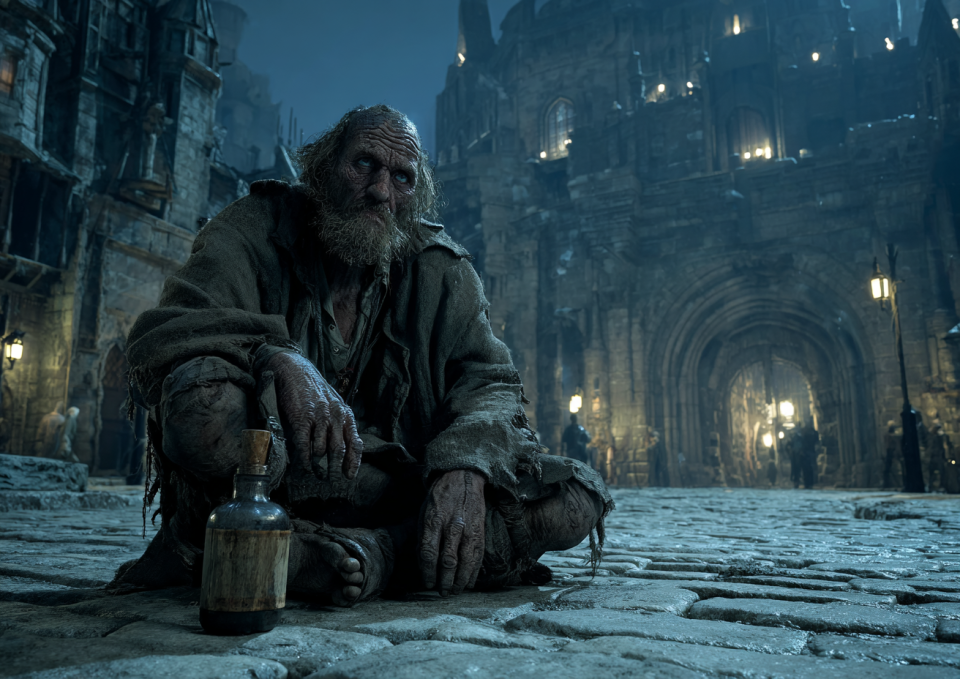
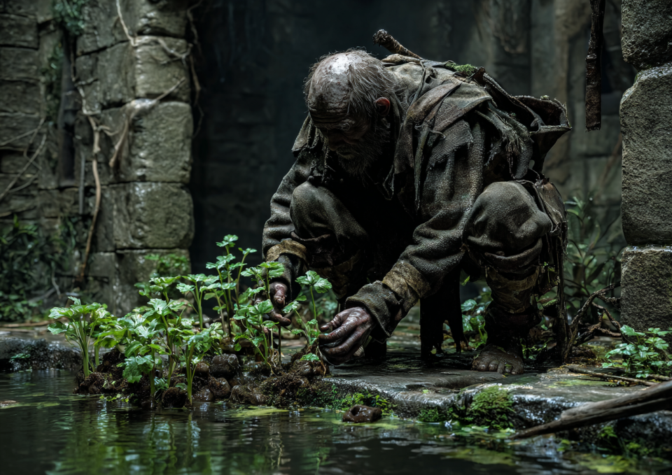
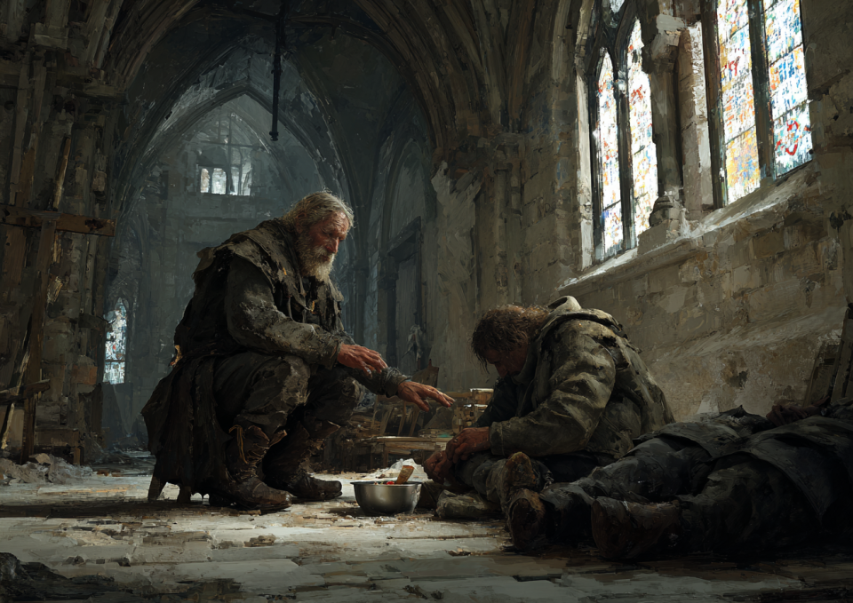
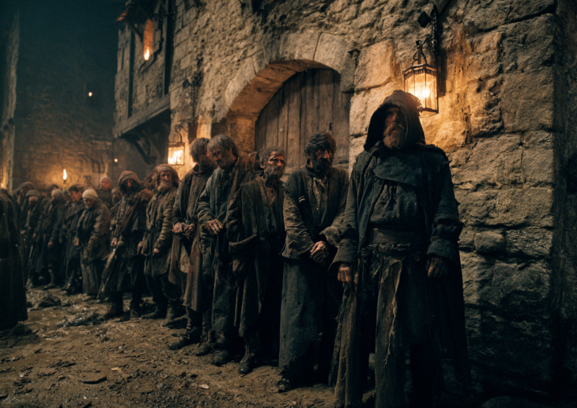
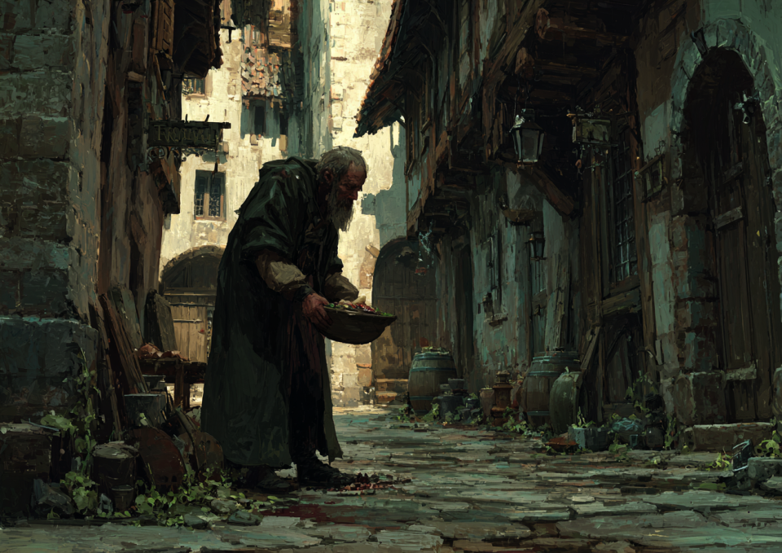

# 【社会問題】ダンジョン前に並ぶ「異臭集団」の正体とは？ 大手クランが使い捨てる「行列代行」の非人道現場

**「朝一番にダンジョンに入ろうとしたら、入り口は既に薄汚れた男たちで埋め尽くされていた」**
**今、王都近郊の有力ダンジョンで多発している「狩場占拠」問題。その背後には、効率至上主義に毒された大手冒険者クランの影があった。**

---

## 聖地を埋め尽くす「並び屋」たち

王都から馬車で1時間の「水晶洞窟」。
希少なクリスタル・リザードが出現することで知られるこのダンジョンは、乱獲防止のために「1日30組限定」という入場制限が設けられている。
かつては、夜明け前から若手冒険者たちが熱気とともに並ぶのが名物だった。

しかし、現在、その光景は一変している。
列を作っているのは、冒険者装備ではなく、薄汚れたボロ布を纏った老人や痩せこけた男たちだ。
彼らは地面に段ボールや藁を敷き、酒を飲んだり寝たりして時間を潰している。異臭が漂い、一般の冒険者は近づくことさえ躊躇われる。

「彼らは我々が雇った『並び屋』だ。文句があるならギルドを通せ」
列の先頭でそう言い放ったのは、王都でも五指に入る大手クラン『金色の獅子』のサブリーダーだ。
入場時間になると、並んでいたホームレスたちは小銭を握らされて散っていき、入れ替わりに現れたクランの主力メンバーたちが悠々とダンジョンへ入っていく。

## 「銅貨5枚」で24時間拘束

本誌は、実際に並び屋として雇われたことのある男性（50代・路上生活者）に話を聞くことができた。

「仕事は簡単だ。ただ座ってるだけ。元締めがいて、場所と時間を指定される。報酬は一日並んで銅貨5枚と、固くなった黒パン１つ。寒い日はキツイが、何もしないよりマシだ」

銅貨5枚。安宿の宿泊費にも満たない端金だ。
これで24時間、雨の日も風の日も野外に拘束される。
「中には風邪をこじらせて、並んでいる最中に亡くなった仲間もいる。でも元締めは『死体があると邪魔だ』と言って、路地に捨てて終わりだ。冒険者様たちは、俺たちを人間だと思ってねえ」

## 密着：ある「並び屋」の凄絶な24時間

本誌記者は、さらに深い実態を探るべく、実際に「並び屋」として生計を立てている初老の男、トマ（仮名・60代）の一日に密着を試みた。
彼はかつて王都の下町で靴職人をしていたが、足を悪くして仕事ができなくなり、路上生活に転落したという。

**正午：王都のゴミ捨て場での「拾い」**

トマの一日は、王都の外れにある巨大なゴミ捨て場から始まる。ゴミ山の深部は魔物が棲み着きすでに「ダンジョン化」しており、立ち入ることはできない。そのため、外周部に新しく捨てられたゴミだけを命がけで漁るのだ。
金属片や木材、細工物の欠片から魔物の素材まで手早くより分け、ドヤ街の素材屋に売りに行く。
「特に重要なのは、固形化した『魔物の脂』だな。これは燃料になるから、高く売れるし自分たちの寒さ凌ぎにも使えるんだ」

**午後2時：どぶ川沿いでの採集稼業**

「拾い」を終えると、次は王都外苑のどぶ川沿いへと向かう。悪臭の漂う水辺を歩きながら、食べられそうな野草を摘み取る。さらに川岸の茂みの奥には、トマがこっそりと育てている芋の苗があった。こうした日々の知恵が、底辺の暮らしを支えている。

**午後4時：教会での配給と水浴び**

夕方が近づくと、スラムの教会を訪れる。ここで配給の食事を受け取り、粗末な施設で水浴びを済ませて体の汚れを落とす。トマは自分の食事を終え、配給の列に並べないほど動けなくなった他のホームレスのもとへ食事を運び、身の回りの世話を始めた。
「こうして動けなくなった奴の世話を手伝うと、神様のお情けで干し肉をもらえたりするんだよ。まあ、明日は我が身だからな」

**午後8時：ダンジョン前への移動・場所取りの開始**

日が落ちると、トマは再び「職場」であるダンジョン前へと歩き出す。指定された順番の場所にボロ布を敷き、ただひたすらに座り込む。夜風は容赦なく体温を奪っていく。
「防寒着なんか買えるわけがない。焚き火もギルドの規則で禁止されてるから、仲間と背中を合わせ合って震えを凌ぐしかないんだ。魔物より冬の風の方がよっぽど恐ろしいよ」

**午前3時：襲いくる睡魔と冒険者からの暴力**
深夜、気温が底を打つ時間帯。眠ればそのまま凍死する危険があるため、必死に意識をつなぎとめる。
「たまに、深夜まで飲んでいた若い冒険者が、俺たちに向かって嫌がらせに蹴りを入れてきたり、ゴミを投げつけてきたりするんだ。逆らえば殺されるから、ただ丸まって『すいません』って謝り続けるだけさ」

**午前6時：交代、手渡される「命の対価」**
夜が明け、開門時間が近づくと、新品同様の高級装備に身を包んだ大手クランの若手メンバーたちが談笑しながらやってくる。トマたちは這うようにして列から退き、元締めから報酬を受け取る。彼の手のひらに無造作に落とされたのは、約束通りの銅貨5枚だった。

**午前7時：夜明けの「夕飯」、そして拠点へ**

過酷な場所取りが終わったトマたちが向かうのは、ドヤ街の飲み屋の裏口だ。朝まで営業していた店から残飯をもらうのが、彼らにとっての「夕飯」である。
「銅貨は大事に取っておくのさ。ここじゃ酒もけっこう余ってて、気前よく分けてもらえるんだ」
残飯で腹を満たし、冷え切った体を酒で温めると、トマはようやく拠点とする薄暗い地下水道の隅へと帰っていく。

薄汚れた手で銅貨を握りしめるトマの濁った瞳には、ダンジョンへ意気揚々と吸い込まれていく冒険者たちへの羨望の光はなく、ただ重苦しい諦念だけが淀んでいた。
彼の過酷な24時間は、数時間の睡眠を経て、また明日も絶え間なくループしていくのだ。

## ギルドの静観、その理由は？

明らかにモラルを欠いたこの行為だが、冒険者ギルドは「ルール上、代理人が並ぶことは禁止されていない」として静観の構えだ。
しかし、あるギルド職員は匿名を条件にこう漏らす。

「大手クランからの上納金……いえ、登録料収入は莫大ですから。彼らの機嫌を損ねるような規制はできないのが本音です。それに、行列代行の元締め自体が、ギルド上層部の親戚という噂も……」

効率を求めるあまり、人の尊厳を踏みにじり、冒険の本質である「挑戦」の機会さえも独占する大手クラン。
彼らが獲得した経験値やレアドロップは、果たして「英雄」の名に相応しいものなのだろうか。

（文・社会部　スラム特捜班）
