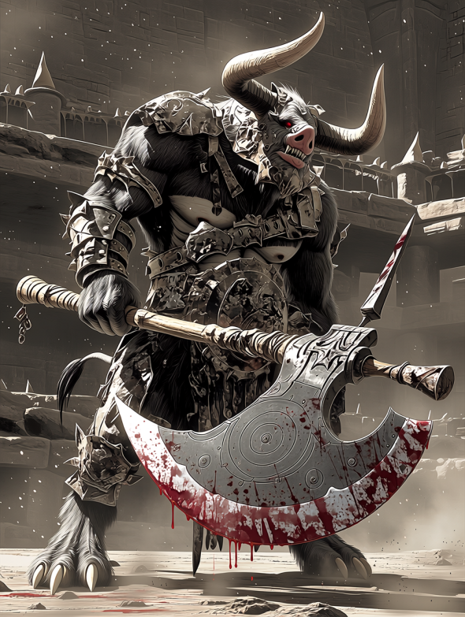

# 【八百長密着】モンスター賭博の闇を暴く！「無敵のミノタウロス」が負けた夜、裏で動いた金と欲望

**熱狂と絶叫が渦巻く地下闘技場。**
**冒険者たちが血銭を賭けるその試合、実は最初から「勝者」が決まっているとしたら？ 元関係者が語る、腐りきった「台本（シナリオ）」の存在。**

---

## 全ては「オッズ操作」のために

「あの試合、ミノタウロスが負けるなんて100人に1人も予想しなかっただろう？ だからこそ、儲かるんだよ」
そう語るのは、元裏闘技場の飼育員C氏だ。

彼が告発するのは、先月行われた「ミノタウロス vs ゴブリンロード」の一戦。
以下は、当時裏社会に出回っていた「闇の魔獣予想紙」の一部だ。競馬新聞さながらの熱気で、魔獣たちの血統や評価が事細かに記されている。

### 【参考資料】当時の闘技場予想紙（一部抜粋）

| 枠 | 予想 | 魔獣名・二つ名 | 血統・出自 | トラックマン（調教師）短評 |
|:--:|:---:|:---|:---|:---|
| 1 | ◎ | **血塗れの巨斧ミノタウロス** | 父：迷宮の暴君（タイラント） 母：深淵の狂牛 | 体格、筋力、凶暴性、全てがSクラスの超良血。過去5戦全試合3分以内の圧勝。鉄板の本命だ。 |
| 2 | 〇 | **疾風のマンティコア** | 錬金術師ゼノ工房作 （素体：獅子・蝙蝠・蠍） | 圧倒的な機動力と空中からの猛毒針が武器。ミノタウロスを出し抜ける機動力を持つ対抗馬。 |
| 3 | ▲ | **装甲のミスリルゴーレム** | 古代ドワーフ遺跡より発掘 （魔力炉：第3世代） | 打撃耐性は完璧だが、やや機動性に欠ける。長期戦・スタミナ勝負の展開になれば浮上する単穴。 |
| 4 | △ | **隻眼のゴブリンロード** | 父：不明 母：不明（廃坑の野生種） | ミノタウロスとの体重差は10倍以上。まともに打ち合えば即死だが、卑劣な小細工がハマれば……大穴。 |

#### 【血統診断：ミノタウロス】

父方に「迷宮の暴君」の血を引く、生粋のインファイター。相手を挽肉にするまで止まらない狂戦士の血脈は、まさに闘将の名を冠するにふさわしい怪物界のサラブレッドである。

#### 【現場記者ダイスの直前予想】

「どう考えても『ミノタウロス vs ゴブリンロード』はミノの圧勝劇。オッズは1.01倍。銀行の金庫より堅い。小鬼が勝つ確率など万に一つもないから、家を抵当に入れてでもミノの単勝一択だ」

---

圧倒的な血統と前評判、そして体格差により、誰もがミノタウロスの圧勝を疑わなかった。だが試合中盤、ミノタウロスは突然動きを止め、あっけなくゴブリンロードの錆びた剣に倒れたのだ。

「直前に餌に『麻痺毒』を混ぜたんだ。遅効性のやつをな。観客は『急所に入った！』と興奮してたが、あれはただ体が動かなくなっただけだ」

## 黒幕は興行主だけではない

驚くべきことに、この八百長には一部の冒険者も関与しているという。
「金のない冒険者が、借金のカタに『負け役』をやらされることもある。魔獣相手に『わざと手傷を負って負けろ』なんて、命がいくつあっても足りない。だが、断れば裏社会の組織に消される」

## 見抜く方法は？

「無理だね。魔獣の状態なんて、遠くの席からじゃプロでも分からん。強いて言うなら、**『胴元や幹部席の奴らが、誰も賭けていない試合』**には手を出さないことだ。奴らが賭けないのは、『結果』を知っていて、かつ『儲けが出ない（配当が安すぎる）』と分かっている時だけだからな」

夢を掴むはずの闘技場は、愚か者から金を搾り取る巨大な集金装置に過ぎない。

（文・ギャンブル評論家　ダイス）
