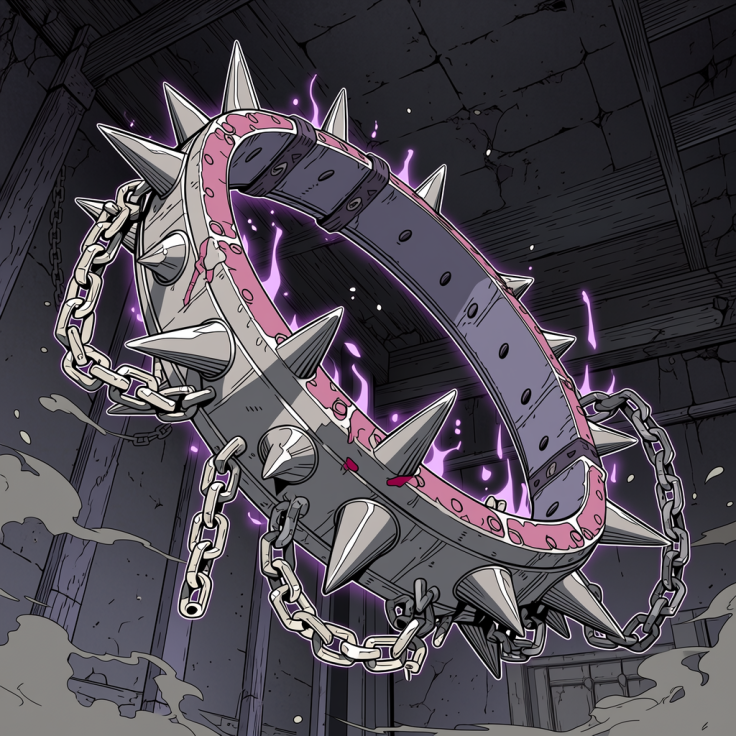
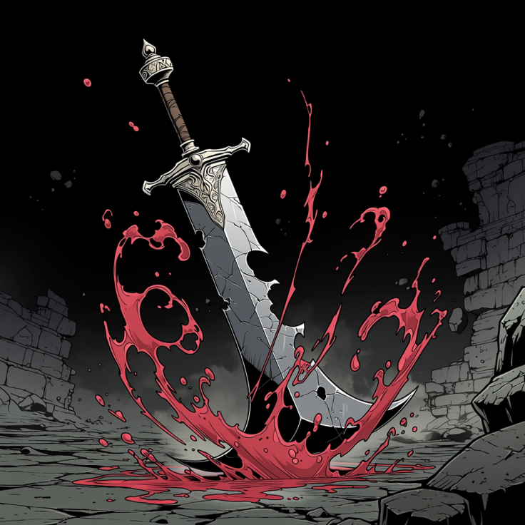
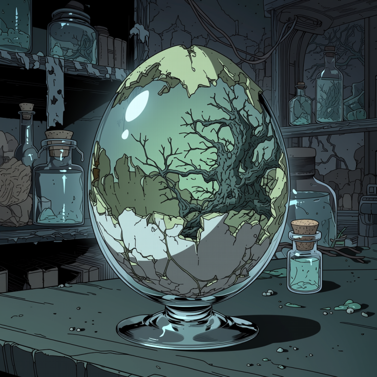
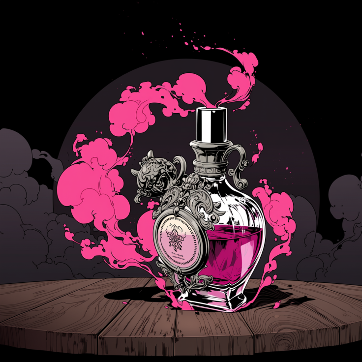

# 【絶対入手禁止】闇市で出回る「違法アーティファクト」カタログ ～これを持っていたら即・死刑！？～

**「強力なアイテムが欲しい」。冒険者なら誰もが抱く願望だ。**
**だが、正規ルートでは手に入らない「禁忌の品」には、それ相応の「呪い」と「罪」が付いてくる。本誌は読者の皆様が誤って手を出さないよう、注意喚起としてそのリストを公開する。**
**（※編集部は購入を推奨しません。絶対に探さないでください）**

---

    

        

            
        

        

            <h2 class="illegal-item-title">1. 隷属の首輪（カオス・チョーカー）</h2>
            <ul class="illegal-item-details">
                <li><strong>闇市相場：</strong> 金貨50枚～</li>
                <li><strong>効果：</strong> 対象の首に装着し、魔力を通すと、装着者は主人の命令に逆らえなくなる。それどころか、命令に従う瞬間に脳髄を焼くほどの強烈な快楽が与えられるため、進んで隷属を望むようになる。</li>
                <li><strong>危険性：</strong> 王国法で所持・売買共に死刑対象。さらに、安物は暴走して装着者の首を飛ばす事故が多発中。</li>
                <li><strong>入手ルートとされる場所：</strong> 貧民街の雑居ビルの古道具屋の合言葉「散歩の時間だ」</li>
            </ul>
        

    

    

        

            
        

        

            <h2 class="illegal-item-title">2. 偽りの英雄剣（カース・ブリンガー）</h2>
            <ul class="illegal-item-details">
                <li><strong>闇市相場：</strong> 金貨100枚～</li>
                <li><strong>効果：</strong> 誰でも剣聖並みの剣技が使えるようになる。</li>
                <li><strong>危険性：</strong> 斬った敵の生命力をエネルギー源とするが、攻撃が外れると「使用者」からエネルギーを徴収する理不尽仕様。一度の空振りで寿命が10年縮むため、極度のプレッシャーで自滅する者が後を絶たない。また、通常時でもエネルギーを必要とするため、使用者はしばしば辻斬り化する。</li>
                <li><strong>入手ルートとされる場所：</strong> 剣の墓と呼ばれる廃棄場ダンジョン。</li>
            </ul>
        

    

    

        

            
        

        

            <h2 class="illegal-item-title">3. 痛喰らいの虫の卵（ペイン・イーター・エッグ）</h2>
            <ul class="illegal-item-details">
                <li><strong>闇市相場：</strong> 金貨30枚</li>
                <li><strong>効果：</strong> 飲み込むか傷口に擦り込むことで体内に寄生し、孵化した幼虫が宿主のあらゆる痛みを食べて完全に無効化する。</li>
                <li><strong>危険性：</strong> ダメージそのものは消えない。「腕が切断されているのに気づかず戦い続け、出血多量で死亡」というケースが後を絶たない。また、ペイン・イーターは常に痛みを求めるため、使用者の中枢神経に作用して自傷行為に走らせるようになる。カプセル剤と偽り、初心者冒険者に売りつけられる代表格。</li>
            </ul>
        

    

    

        

            
        

        

            <h2 class="illegal-item-title">4. 魅惑の香水（サキュバス・バースト・ポーション）</h2>
            <ul class="illegal-item-details">
                <li><strong>闇市相場：</strong> 銀貨50枚（小瓶）</li>
                <li><strong>効果：</strong> 異性を強烈に惹きつけるフェロモンを放つ。</li>
                <li><strong>危険性：</strong> 効果が強すぎて、人間だけでなくゴブリンやオークまでも呼び寄せてしまう。「モテすぎて死ぬ」を地で行くアイテム。</li>
            </ul>
        

    

---

**【警告】**
これらのアイテムは、王都の衛兵隊が重点的に捜査・摘発を行っています。
「持っているだけで犯罪」になるものが大半です。
甘い言葉で売買を持ちかけられても、決して応じないように！

（文・アイテム鑑定士Ｘ）
