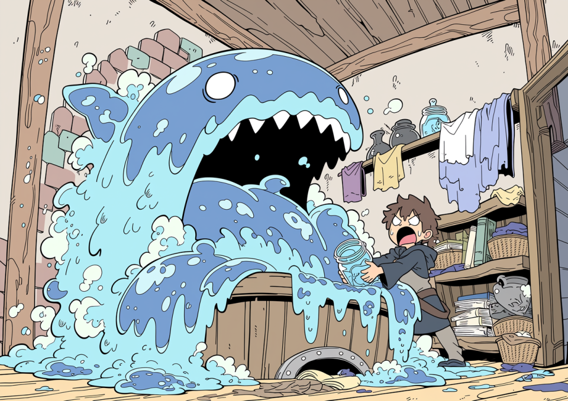
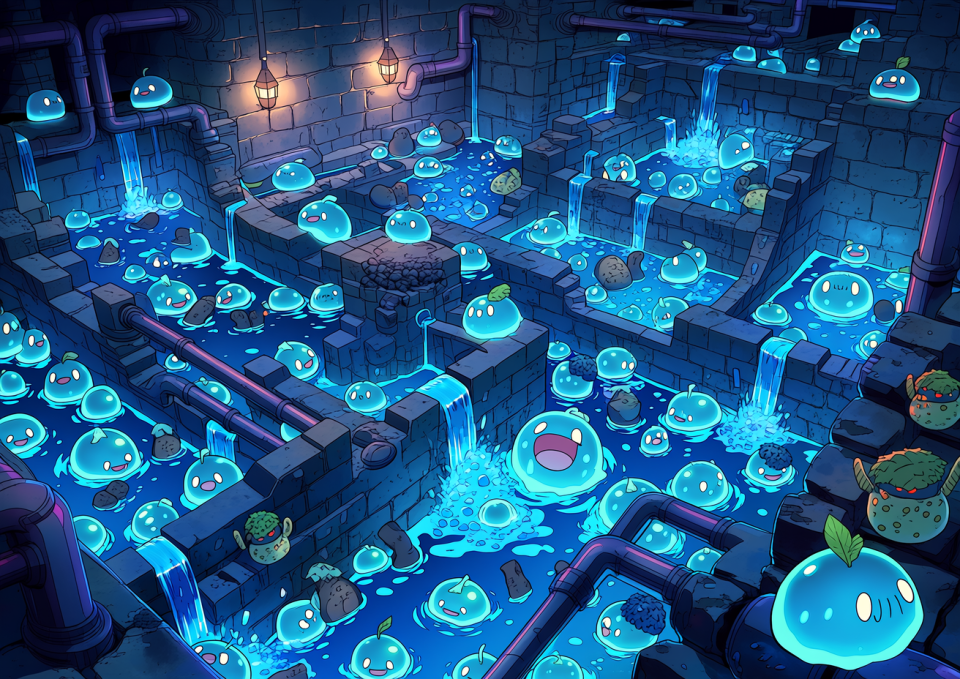
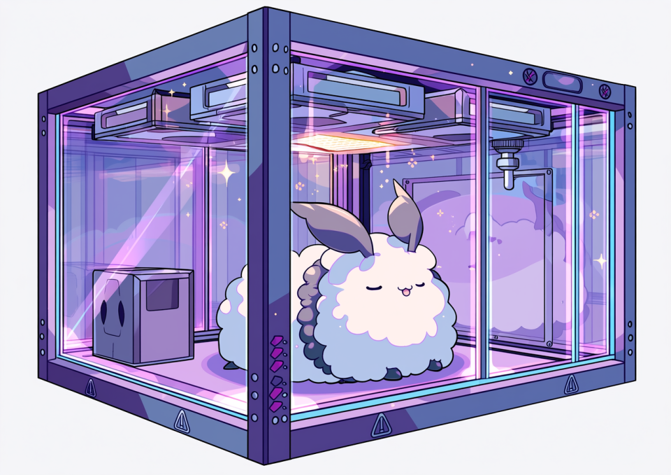
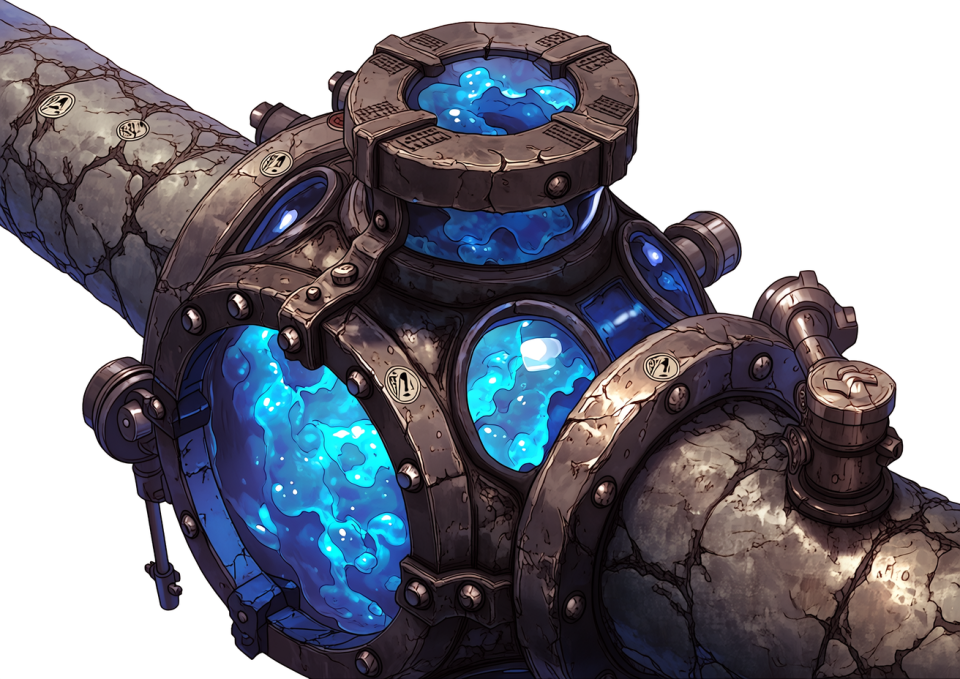
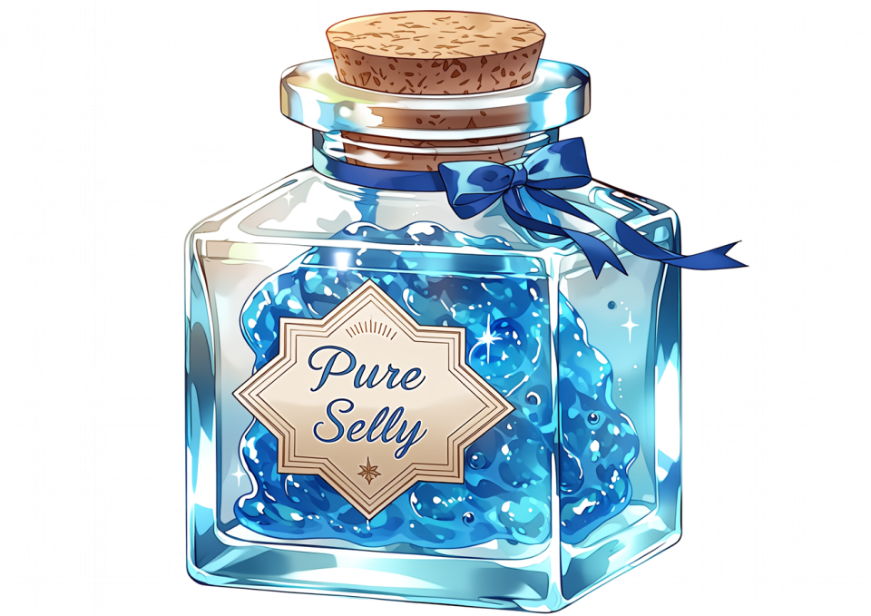

# 【連載】魔術師の副業：はじめての「魔物飼育」

## 第1回：その“ペット”、違法です。～地獄のライセンス取得編～

魔術研究には、とにかく金がかかる。
触媒、媒質、術式刻印用の希少鉱石、保存液、解毒剤、補修材、失敗実験の後始末。どれを取っても安くはない。研究室に一日こもって術式を一つ試すだけで、普通の職人が半月かけて稼ぐ額が平然と吹き飛ぶ。
とりわけ生体素材を扱う系統――毒液、粘液、分泌腺、翅粉、魔力嚢、再生組織などを必要とする分野では、素材を市場で買い続ける方式は、金貨を火にくべるのとほとんど変わらない。

そこで多くの若手魔術師が、いずれ必ず一度はこう考える。

**「買うから高い。なら、自分で育てればいいのではないか？」**

実に自然な発想である。
毒蛾が欲しいなら毒蛾を飼えばいい。スライムゼリーが要るならスライムを殖やせばいい。解体素材が高いなら、育成から収穫まで自前で回せばいい。
研究・生産・加工を一気通貫で内製化する。言ってしまえば、これぞ魔術師流の究極の自給自足であり、血と粘液にまみれたDIYである。

だが、王都はそこまで甘くない。
魔物を「ちょっと飼う」だけでも、王都では立派な危険生物取扱行為と見なされる。必要になるのが、通称**「第一種危険生物飼育免許」**。
響きは仰々しいが、要するに役所が言っていることは一つだ。

**「お前の研究欲と副収入のために、隣人を死なせるな」**

その一点に尽きる。

---

## ■ なぜ許可が必要なのか？

こういう話をすると、必ず出てくるのが
「たかがスライムだろ」
「蛾くらい箱に入れておけばいいだろ」
という、無知と楽観が合体した恐るべき素人意見である。

だが王都の役人も、最初からここまで厳格だったわけではない。
規制強化には、きちんと血塗られた歴史的経緯がある。

有名なのが、十数年前の**「下町スライムパンデミック事件」**だ。

当時、ある学者崩れの男が「低級スライムならタライでも飼える」と豪語し、家賃の安い木造アパートの一室で簡易培養を始めた。初期費用をケチり、封印瓶も使わず、床には防蝕処理すら施していなかったという。
結果は言うまでもない。個体数管理に失敗し、分裂速度が餌供給量を上回り、床板を溶かし、排水路を伝い、地下の共同貯水槽に侵入。
三日後にはアパート一棟が半ば溶解し、住民十七名が避難、周辺区画は丸ごと封鎖。最終的に王都工兵隊と浄化班が出動し、区画ごと焼却・中和処理する羽目になった。

しかも本当に厄介なのは、スライムが室内だけで完結しないことだ。
こぼれた個体、洗浄時に流した粘液、解体後の残渣、希釈したつもりの培養液。こうしたものが台所、洗い場、床排水から下水へ流れ込むと、**汚水槽、雑排水槽、下水管内の有機汚泥や生活排水を餌にして増殖する**。

現実の油脂分が配管内に堆積して詰まりを起こすのと同じように、この世界ではスライム由来の粘質生体が排水系に居着き、配管内壁に薄膜状のコロニーを形成し、それが核になって爆発的な繁殖を始める。
最悪なのは、住人本人が「ちゃんと流したから処理した」と思っているケースである。流した時点で処理は終わっていない。むしろそこから先が災害の始まりだ。

このため王都では現在、スライムおよび準スライム系生体を扱う施設に対し、排水設備として
**「スライムトラップ」**
および
**「スライムフィルター」**
の設置が義務付けられている。

役割としては、現実でいうところのグリストラップやグリスフィルターに近い。
つまり、**排水に混じった危険な生体成分を、下水へ流す前に建物側で捕捉・分離・回収する設備**である。
スライムトラップでは比較的大きな粘塊や分裂片を沈降・隔離し、後段のスライムフィルターで微細な粘液片、幼生核、再生性の高い膜状組織を捕まえる。
これを怠ると、下水槽や雑排水槽の中で静かに増殖が始まり、ある日突然、**建物全体の排水が逆流し、浴場・便所・洗い場から半透明の青い粘体がせり上がってくる**という、誰も得をしない地獄絵図が完成する。

王都の衛生行政がこの設備に神経質なのも当然である。
スライムは「一匹逃げたら終わり」ではない。**流す、残る、育つ、詰まる、増える** の五段活用でインフラに住みつく。
そのため、スライムを扱う飼育者には、トラップとフィルターの設置だけでなく、**定期清掃・回収記録・回収物の適正焼却または薬液処理** まで義務付けられている。
これを怠った場合、単なる飼育違反では済まない。**下水インフラ汚染行為**として、衛生局・建築局・場合によっては地区管理組合まで巻き込んだ処分対象になる。

事件報告書には、乾いた筆致でこう記されている。

**「低危険種であっても、管理が低能であれば災害は高危険種に匹敵する」**

あまりにも正論で、しかも救いがない。
この事件以来、王都における危険生物飼育の扱いは一変した。
いまや規制水準は、下手をすると**銃火器や高位呪物の所持管理と同程度**、あるいはそれ以上である。
魔物は暴発したら終わりではない。**逃げる。殖える。住みつく。環境に適応する。時には繁殖する。** つまり事故がその場で終わらず、地域災害へ成長するのだ。役所が神経質になるのも当然である。

---

## ■ ライセンス取得への「4つの壁」

これから飼育を志す諸君に、夢を壊すようで悪いが、まず現実を教えよう。
危険生物飼育は、知識と根性さえあれば始められる類の趣味ではない。
むしろ必要なのは、**資金、設備、書類、そして近隣に頭を下げる胆力**である。

「飼う」という一語の裏には、役所・工務店・保健所・魔術協会・大家・近隣住民との地獄の折衝が詰まっている。

---

### 1. 保管設備の基準（防護壁とセンサー）

まず最初に立ちはだかるのが設備基準だ。
ここで脱落する者が最も多い。理由は単純、**高いから**である。

飼育室や檻は、対象魔物の危険度に応じた基準を満たさなければならない。
牙が危険なのか、毒が危険なのか、胞子が危険なのか、鳴き声に精神汚染があるのか、体液に腐蝕性があるのか。魔物ごとに危険の種類が違う以上、必要設備も一律では済まない。
「丈夫な箱に入れておく」程度の発想では、まず許可は出ない。

たとえば、素材用途としてそこそこ人気のある**「ポイズン・モス（毒蛾）」**を飼いたいとしよう。

この時点で要求されるのが、まず
**「魔法機構安全キャビネット」**
通称、**魔導ドラフトチャンバー** の設置である。

名前だけ聞くと、いかにも学者が好みそうな立派な装置だが、実態はもっと生々しい。
これは単なるガラスケースではない。高価な透明板で囲った飼育棚でもなければ、見栄えのいい展示箱でもない。
役目はただ一つ、**中の危険を外へ漏らさないこと**。
もっと正確に言えば、**「中で発生する毒・胞子・呪気・微細魔力粒子・揮発性分泌物を、外気側に逆流させず、吸い込み、捕まえ、壊し、無害化した上で排出すること」**に尽きる。

つまり、魔導ドラフトチャンバーとは、
魔物のための檻というより、**飼い主を生かしておくための棺桶のフタ**である。

構造もやたらと大げさだ。
キャビネット内部は常時**負圧**に保たれ、前面の作業口を少し開けても、空気は必ず室内側から内部へ吸い込まれるよう設計されている。これにより、毒蛾が翅を震わせて撒き散らす鱗粉や、羽化時に発生する微量の麻痺性ガス、幼虫飼料の腐敗で生じる有害蒸気が、作業者の顔面に吹き返すのを防ぐ。
さらに内部を通過した空気は、そのまま外へ捨てられるわけではない。多層フィルターを通り、必要に応じて**中和術式**、**燃焼術式**、**低温凝集術式**、**浄化符**などを段階的に通過し、ようやく「一応は街に返してよい」と判断されるレベルまで処理される。

この“一応”が実に嫌らしい。
なにしろ相手はただの煙ではなく、魔物由来の粒子だ。
物質的には微量でも、呪術的にはしっかり害を持つことがある。
普通のフィルターなら通してしまうし、普通の換気扇では近所一帯に毒鱗粉をばらまく装置に早変わりする。
そのため王都の基準では、対毒・対呪・対微粒魔素の三系統を想定した排気処理が求められる。
つまり、**高い。とにかく高い。**

しかも導入して終わりではない。
この手の設備は「ある」ことより、「正常に動いている」ことのほうが重要だからだ。
風量が落ちていないか。
封印縁が摩耗していないか。
術式板の刻線に乱れがないか。
吸引ファンに魔力詰まりが起きていないか。
中和カートリッジの寿命は残っているか。
浄化符は湿気っていないか。
点検項目は馬鹿みたいに多い。

さらに地獄なのは、このドラフトチャンバーが**単体で完結しない**ことだ。
役所が要求してくるのは「箱」ではなく、**箱が置かれる環境全体**である。
したがって、設置に伴って次のような工事まで必要になる。

* 部屋全体の二重構造気密化
* 床・壁面への防蝕、防毒、防呪コーティング
* 排気経路の専用化と逆流防止弁の設置
* 排気フィルター（対毒・対呪い仕様）の定期交換機構
* キャビネット内の緊急サプレッション（焼却・凍結・封印）システム
* 停電・魔力断に備えた予備魔晶電源
* **魔術濃度センサー術式 ＆ 連動アラーム**

そして、スライム系や粘液系を扱う場合にはこれに加えて、排水設備側にも追加基準が乗る。
すなわち、**床排水・洗浄排水・解体洗浄槽から下水へ至る経路の途中に、スライムトラップおよびスライムフィルターを設けること**。

これがないと、どれだけ飼育箱を厳重にしても、洗浄水の一回の排水で全部が台無しになる。
「檻の外に逃がさない」だけでは不十分で、王都は**「排水の先まで含めて飼育空間である」** という考え方を取っているのだ。これは実務上かなり重い。

特に最後のセンサーが厄介だ。
こいつは本当に情け容赦がない。
室内の魔力汚染濃度、毒性粒子濃度、呪的残留値を常時計測し、基準値をわずかでも超えた瞬間、警報を鳴らす。しかも鳴るだけでは済まない。
現行規則では、一定閾値以上の漏出を検知すると、**王都警備隊・衛生保健局・地区担当査察官へ自動通報**が飛ぶ。
つまり、「ちょっと漏れたので様子を見よう」ができない。
誤作動であっても一度通報が走れば、後日ほぼ確実に事情聴取と設備確認が入る。
うっかり夜中に警報を鳴らそうものなら、寝巻き姿で役人に頭を下げる羽目になる。

しかも恐ろしいことに、役所はこの自動通報を「住民保護の観点から当然」と本気で思っている。
実際その通りなので、反論の余地がないのがまた腹立たしい。

ここまでやって、ようやく「ポイズン・モス飼育室の最低ライン」である。
**ドラフトチャンバー本体、排気処理系、センサー、気密工事、術式刻印、予備電源まで含めれば、金貨30枚では済めば御の字。さらにスライム系を扱うなら、スライムトラップやフィルター、洗浄槽の防蝕改修、定期清掃契約まで上乗せされる。立地と施工業者によっては40枚、50枚も普通に見えてくる。**
若手魔術師が副業として始めるには、あまりにも初手のパンチが重い。

そして忘れてはならないのは、これはまだ**「飼う許可を申請するための土俵に立つ費用」**にすぎないということだ。
魔物本体はまだ一匹も買っていない。

---

### 2. 近隣住民の同意書と、不動産の冷たい現実

次に来るのが、人間関係と不動産実務の壁である。
金で解決できるだけ設備のほうがまだ優しい、と感じる者さえいる。

王都の規則では、一定ランク以上の危険生物を住宅地または集合住宅内で飼育する場合、建物所有者、管理人、場合によっては隣接住戸・上下階住戸の居住者から**事前同意書**を取る必要がある。
平たく言えば、

**「隣の部屋で毒蛾を育てます。万が一逃げたら被害が出ますが、制度上は安全対策してます」**

という話を、自分の口で説明して印をもらってこい、ということだ。

押してもらえると思うか。
普通は無理である。

相手の立場になってみればよく分かる。
壁一枚向こうで、毒や呪いや胞子を持つ生き物を飼うと言われて、
「なるほど、研究熱心ですね。応援します」
とはならない。
たいていは
「いや、出て行ってくれ」
で終わる。

しかも、この手の説明で一番まずいのは、嘘がつけないことだ。
「危険はありません」と言えば、後で書類と整合しない。
「危険はありますが管理します」と言えば、当然嫌がられる。
制度上の誠実さと、近隣の安心感が根本から食い違っているのである。

そして、ここでもう一つ現実的な問題がある。
**賃貸物件は、魔物飼育の痕跡を異常に嫌う。**

理由は単純で、退去後の原状回復費が跳ね上がるからだ。
魔物、とりわけスライム系・腐蝕系・毒虫系を無断で持ち込んだ部屋は、見た目が無事でも中身が死んでいることが多い。
床材の下地が酸で傷んでいる。
排水管の内側に粘質膜がこびりついている。
雑排水槽に微細個体が残っている。
壁紙や目地に臭気が染み込んでいる。
換気ダクト内に鱗粉や胞子が堆積している。
表面清掃だけでは到底足りず、床材交換、配管洗浄、罠設備の分解清掃、場合によっては一部解体と再封印処理まで必要になる。

このため、不動産実務では
**「魔物無断飼育歴あり」**
は、単なる契約違反ではなく、**高額な特殊清掃・原状回復案件**として扱われる。
敷金でどうにかなるレベルではないことも多く、退去時に追加で金貨数枚から十数枚単位の請求が飛ぶことも珍しくない。
特にスライムを流していた物件は最悪で、表面上は綺麗でも、汚水槽や雑排水槽にコロニーが残っていれば、建物管理側は配管系統全体の洗浄と点検をせざるを得ない。
当然、その費用は大家が笑顔で被ってくれるものではない。**だいたい借主に来る。**

つまり、勝手に魔物を買うというのは、
「バレたら怒られる」
程度の話ではない。
**退去時に請求書で殺される** 可能性があるということだ。

結果、多くの魔術師は普通の賃貸を諦め、最初から**魔術師向け防音・防臭・防呪仕様の専用物件**を探すことになる。
もちろん家賃は高い。
設備負担の上に固定費まで増える。
副業で金を浮かせたいのか、住居費で首を絞めたいのか、だんだん分からなくなってくる。

---

### 3. 終わらない事務作業（観察記録の保存）

設備を揃え、住民同意を取りつけても、まだ終わらない。
ここから始まるのが、役人の愛してやまない書類地獄である。

魔物は生き物だ。
生き物である以上、毎日状態が変わる。
よって、毎日の観察結果を記録しろ――という理屈自体は理解できる。問題はその**要求水準**だ。

王都指定の**「観察記録簿（公式フォーマット）」**には、単なる生存確認では済まない細目が並ぶ。
摂餌量、排泄量、体表変色、魔力波形、攻撃性の有無、反応遅延、脱皮・分裂・羽化の兆候、分泌液の粘度、鳴音の周波数、異臭の有無、室温・湿度・魔素濃度。
種によってはそこにさらに、呪文反応性や対光反応、睡眠周期、拘束具損耗状況まで加わる。
スライム系であればこれに加え、**回収粘液量、分裂核数、廃液量、トラップ清掃日、フィルター交換日、排水処理後の残留魔素濃度**まで記録項目に入ってくる。

つまり
「今日は元気だった」
では済まない。
**元気を数値で書け**
というのが役所の要求である。

しかもこれを、原則として**毎日**、欠損なく、読める字で、改竄不能な形式で残し、**3年間保存**しなければならない。
更新審査では高確率で過去記録を見られるし、記載漏れや異常値未報告があれば、それだけで管理能力に疑義を持たれる。
魔術師というのは本来、もっと自由な知の探求者であるはずなのだが、免許取得後の実態はかなり**几帳面な飼育員兼経理担当兼配管管理人兼書記官**に近い。

---

### 4. 定期的な「抜き打ち査察」

そして最後に待っているのが、査察である。
これが精神的にはたぶん一番きつい。

王都保健局、地区衛兵隊、場合によっては**魔術協会の査察官**まで加わって、事前予告なしで飼育設備を確認しに来る。
彼らは別に怒鳴り込んでくるわけではない。むしろ事務的で、礼儀正しく、淡々としている。
だが、その静かな態度がかえって怖い。

センサーは生きているか。
記録簿は揃っているか。
フィルター交換日は基準内か。
檻の蝶番に腐食はないか。
床面の防蝕処理に剥離はないか。
非常封印符の有効期限は切れていないか。
予備魔晶の残量は十分か。
申請種以外の個体をこっそり飼っていないか。
スライムトラップの清掃は実施されているか。
回収残渣の処分伝票は残っているか。
雑排水槽からの残留反応は出ていないか。

一つでもまずい点が見つかれば、その場で改善命令、悪質なら使用停止、さらに悪ければ**免許剥奪**である。
飼育個体は当然没収。危険判定が付けば、そのまま**焼却処分または封印処分**になる。
愛着をもって育てた個体が、役所の判断一つで「危険廃棄物」扱いに落ちる。
これが法の現実だ。

---

## ■ それでもやる価値はある？

ここまで読めば、ほとんどの読者は
「そんな面倒なことをしてまで、なぜ飼う？」
と思うだろう。
その問いに対する答えは、極めて俗っぽく、そして強い。

**儲かるからだ。**

たとえば市場で1グラムあたり銀貨5枚前後する**純正スライムゼリー**。

これが安定飼育に入れば、自宅規模でも相当量を継続採取できる。
薬剤素材、触媒基材、保湿媒質、低級再生処置の下地など、用途が広く、需要が切れにくい。
品質が安定していれば研究用にも売れるし、自分で使えば素材費を大きく削れる。

ただし、スライム相手の現実は、想像以上に“設備産業”である。
採れて終わりではない。
毎日の給餌、生体状態の確認、排出物の分離、容器洗浄、分裂管理、床や壁の腐蝕補修、臭気対策、逃亡防止。
さらに、洗浄水や残渣を雑に流せば下水系で繁殖するため、**スライムトラップの掻き出し、スライムフィルターの洗浄・交換、回収粘体の焼却または薬液失活処理**まで付いてくる。
要するにスライム飼育とは、可愛い副業どころか、**半分は配管メンテナンス業**でもあるのだ。

だが、その手間を上回るだけの実利があるからこそ、皆こっそり始めたがる。
研究者にとって、素材を自前で回せるというのは、それだけで圧倒的な自由である。
市場価格や品薄に振り回されず、欲しい時に欲しい品質の素材を確保できる。
この魅力は強い。強すぎる。

---

## ■ 抜け道：いっそ「ダンジョンに住む」

さて、ここまでの話を聞いて、
「地上でやるのが馬鹿らしくなってきた」
と思った者もいるだろう。
その感覚は、わりと正しい。

実際、一部の魔術師たちはもっと単純な結論にたどり着く。

**「なら、規制の外で飼えばいい」**

すなわち、**ダンジョンの中に住む** という発想である。

王都の建築法、衛生規則、危険生物飼育規則、近隣同意制度――その大半は、あくまで**王都結界内の地上居住区**を前提に設計されている。
ならば、その外へ出る。
ダンジョン中層に隠れ家を作り、そこを飼育・培養・解体・加工の拠点にしてしまう。

そうなれば、地上の制度はかなり届きにくくなる。
センサー設置義務もない。
近隣住民の同意もいらない。
保健所も定期巡回してこない。
多少危険な魔物を増やしたところで、苦情を入れてくる隣人もいない。
税も家賃も査察もない。
たしかにそこは、ある種の自由の国に見える。

実際、腕に覚えのある魔術師や、地上で生活基盤を持てなかった流浪民、あるいは表の制度からはみ出した技術者たちの中には、ダンジョン内に半定住して生きている者がいる。
彼らにとっては、危険と不便を呑み込めるだけの力さえあれば、ダンジョンは王都よりずっと住みやすい。

ただし当然ながら、その自由には役所の保護が付いてこない。
設備基準がない代わりに事故っても自己責任。
苦情がない代わりに、襲われても誰も助けてくれない。
査察がない代わりに、隣の培養槽が夜中に破裂しても全部自分で片づけるしかない。

そして何より、そこで飼っているのは可愛い小鳥でも猫でもない。
**魔物**である。
寝ている間に檻が壊れ、愛着をもって育てた個体に首筋を噛み裂かれる。
あるいは飼育個体より先に、野生の何かに隠れ家ごと襲われる。
地上の面倒くさい制度が、実は「死なないための代償」だったのだと、その時になって理解しても遅い。

---

## **【警告】ダンジョンは“無法”ではあっても“無主”ではない**

ここで一つ、勘違いしてはならないことがある。
ダンジョンは公権力の支配が薄い。これは事実だ。
しかしそれは、誰の支配も存在しないという意味ではない。

特定の階層、採集場、通路、水場、鉱脈、あるいは安全地帯が、**特定ギルドや半武装集団の実質支配下**に置かれていることは珍しくない。
表向きは自由競争を掲げていても、実際には通行料、場所代、採集割当、搬出税、護衛費、保安名目の上納金が課される。
彼らの縄張りで勝手に繁殖施設や培養室を作れば、役所の査察より先に、もっと即物的な“指導”が飛んでくる。

独自ルールを破った場合に待っているのは、行政文書ではない。
**高額な過料という名のみかじめ料**、設備破壊、素材没収、締め出し、そして場合によっては露骨な暴力である。
公権力が届かない場所には、たいてい別の力が居座る。
自由とは、優しさではない。
ただ、責任の請求先が変わるだけだ。

この連載では今後、そうした“地下の現実”についても折に触れて触れていくつもりだが、第一回の結論だけ先に言っておく。

**魔物飼育は儲かる。だが、その前に制度が牙をむく。**
そして制度を避ければ、今度はもっと直接的な牙が待っている。

その“ペット”を飼う前に、まず考えろ。
お前が欲しいのは副収入か。研究素材か。自由か。
それとも単に、自分だけは上手くやれると思い込んでいるだけなのか。

---

**次回のテーマ**
**「初心者におすすめ！ 比較的おとなしい（けど臭い）マンドラゴラの水耕栽培」**
