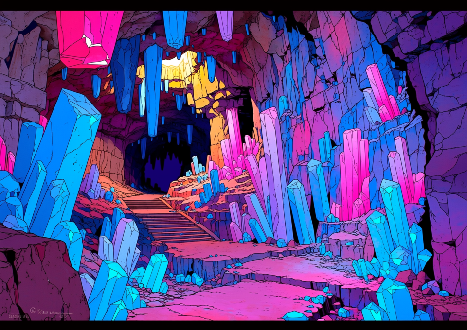
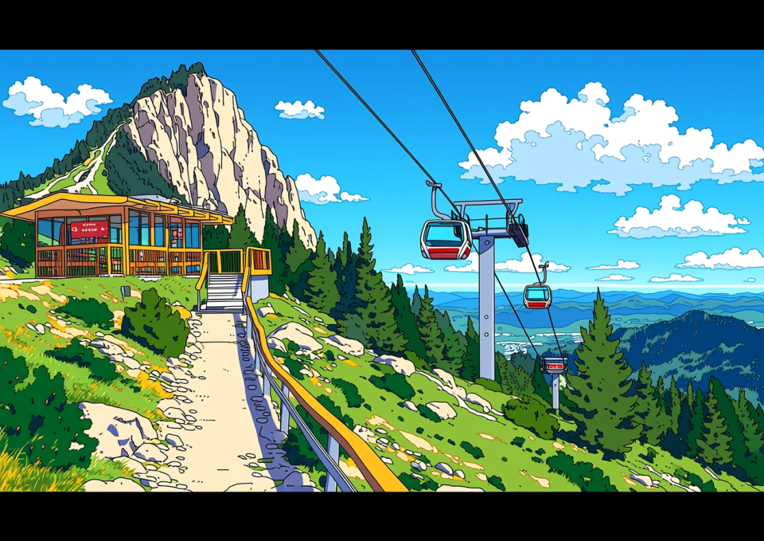
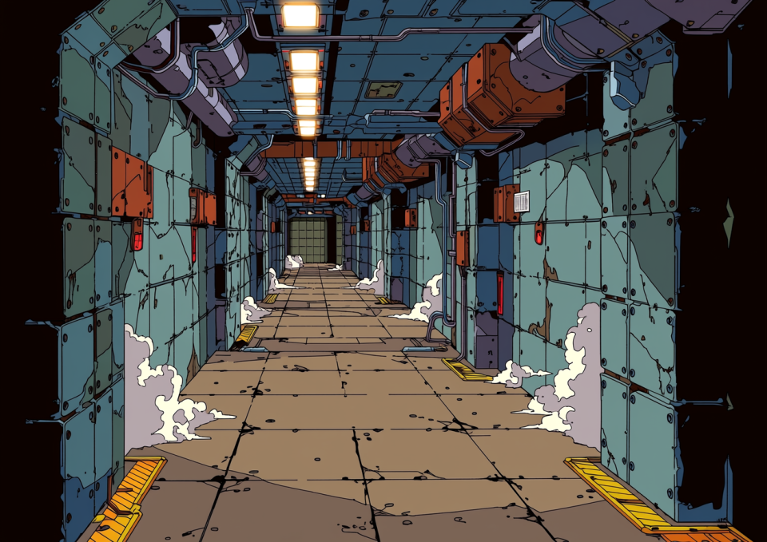

# 今週末どこ行く？ 王都周辺【映え＆稼げる】名物ダンジョン4選！

やっほー！ 編集部のミカです！
最近「ダンジョン＝怖い」とか思ってない？ ノンノン！
いま王都周辺のダンジョンは「デートスポット」や「稼ぎ場」として超進化してるの！
今回は、初心者でも安心な場所から、ちょっと背伸びしたい人のためのスポットまで、厳選4つを紹介しちゃうよ～！

---

## 1. まるで宝石箱！ デートならココ一択
### クリスタル・パレス（北・リゾート区画）

**「え、これダンジョンなの！？」** って驚くこと間違いなし！
壁一面がキラッキラの発光クリスタルで覆われてて、もう幻想的すぎてヤバイ。
最近はカップルだらけで、ここで告白すると成功率が上がるって噂も…？

*   **推しポイント**:
    *   **サファリツアー**: 安全な場所から狂暴な魔物を見れる！ スリル満点だけど安全だから彼氏の前でキャーキャー言えるよ（笑）
    *   **クリスタル饅頭**: 出口で売ってるコレが意外とウマい。お土産にマスト！
    *   **注意**: 併設のホテル高層階「ラウンジ」への階段はガチダンジョンだから間違って入らないようにね！

---

## 2. 山ガール必見！ 絶景とハイキング
### はじまりの洞窟（改）（南エリア）

「はじまりの洞窟」がリニューアルしてたって知ってた？
なんと、中腹まで**自動ゴンドラ**で行けちゃうんです！
汗だくにならずに絶景カフェまで行けるとか、最高すぎない？

*   **推しポイント**:
    *   **観光ルート（1号路）**: スライムすら出ない舗装路。スニーカー＆普段着でOK！
    *   **山頂カフェ**: 映え写真撮り放題。空気がおいしい～！
    *   **警告**: 「修練ルート」とかいう裏道には絶対行っちゃダメ！ ガチの魔獣が出るからね！ 死ぬよ！？

---

## 3. ちょっとワルいのがカッコいい？ 一攫千金の鉄板
### 鉄板迷宮（西・スラム地下）

「お上品な場所は飽きた」「金が欲しい」
…そんなキミにはここ。通称『鉄板』。
その名の通り、そこら中が鉄板で補強されてる無骨なダンジョン。

*   **推しポイント**:
    *   **稼げる**: 金属系のドロップ素材がおいしい！ 学生のお小遣い稼ぎにも人気（ただし自己責任で）。
    *   **ヤンチャな雰囲気**: なんかワルそうな人たちがいっぱいいてドキドキする。
    *   **絶対ルール**: 無許可での素材持ち出しはNG！ 指を詰められちゃう（物理）らしいから、ちゃんと換金ルールは守ろうね！

---

## 4. まさに天空の楽園！ 憧れのVIPリゾート
### 天空リゾート『聖域エデン』（王都上空）

最後はここ！ みんなの憧れ、空に浮かぶ島『エデン』！
入場料は高いけど、一生に一度は行きたいよね～。
帝国側のギラギラしたドーム・シティとは違って、こっちは「究極の癒やし」がテーマ。

*   **推しポイント**:
    *   **聖水スパ**: 浸かるだけでお肌ツルツル、病気も治る！？ 天使型ゴーレムの接客も神対応。
    *   **免罪符**: ちょっとした罪ならリセットできるらしい。買いすぎ注意（笑）
    *   **アクセス**: 転送ゲートでお金払っていくのが正解。「試練の塔」を登ってタダで入ろうなんて考えちゃダメだよ（聖騎士にボコられます）。

---

## ミカのまとめ
いかがでしたか？
週末はダンジョンで「非日常」を味わっちゃおう！
あ、でも**「死んでも文句言わない」**のがダンジョンの鉄則。
準備運動とポーションはお忘れなく！
それじゃ、いってきま～す！
