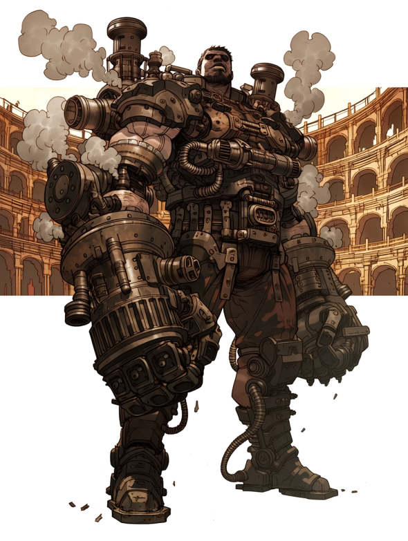
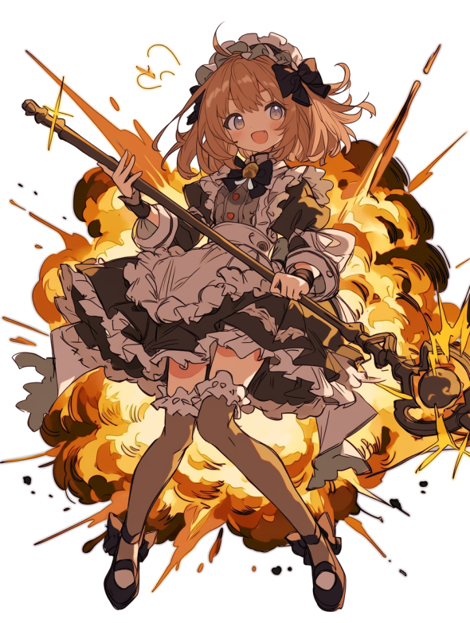

# 【闘技場】推しが見つかる！ 今アツい「名物選手」4選！

こんにちは！ 編集部のミカです！
王都の夜といえば「闘技場（コロシアム）」！
「野蛮で怖い…」なんて食わず嫌いはもったいない！
今は実力だけじゃなく、**強烈なキャラクター**を持った選手たちが大人気なんです。
今回は、編集部が厳選した「推せる」4選手を紹介しちゃうよ！

---

## 1. その体は鉄か、魔法か
### 鉄の暴君『ギア・ガンドル』

**「蒸気（スチーム）と暴力のハーモニー！」**
全身を無骨な「試作型・強化外骨格」で覆った大男。
蒸気を噴き上げながら、巨大な機械の腕で魔物をミンチにする姿は圧巻！
「中身は脳だけのサイボーグ」なんて噂もあるけど、そのロマン溢れる戦い方に男の子（と一部のマニア）はメロメロ！
必殺の『スチーム・パイルバンカー』が決まった瞬間の歓声は、ドーム・シティ一番の熱気かも！？

---

## 2. 踏まれたい男子急増中！？
### 蒼雷の女豹『ミリアム・ヴァイパー』

**「女王様、僕も切ってください！」**
ボンテージ風レザーアーマーに身を包んだ、サディスティックな美女剣士。
目にも止まらぬ双剣と雷魔法で、相手をなぶり殺しにする「処刑ショー」が大人気！
彼女が勝つと観客席に投げキッス＆敗者をヒールで踏みつけるのがお約束。
実は没落した元・貴族令嬢で、借金返済のために戦っているという「悲劇のヒロイン」設定も、ファンの庇護欲をそそるとか…？

---

## 3. 笑いと恐怖のサーカス団
### 不死身の道化師『ジョーカー・ボーン』

**「子供は泣くけど大人はハマる！」**
骸骨マスクを被った不気味な魔術師。
自分の骨を切り離して操ったり、倒した魔物をその場で蘇生させたりと、戦い方はグロテスクそのもの。
でも、戦いながらジャグリングをしたり、観客を煽ったりするパフォーマンスは超一流！
悪役（ヒール）として完璧な振る舞いに、いつの間にか彼を応援したくなっちゃう不思議な魅力があります。
※お昼の部は出入り禁止です（笑）

---

## 4. 爆発こそ正義！ 最凶ロリータ
### 爆殺令嬢『レイチェル・ボム』

**「カワイイ顔してド派手な爆撃！」**
フリフリのロリータ服を着た可憐な少女…に見えるけど、中身は爆炎魔法のスペシャリスト！
「えいっ♡」と杖を振るたびに、闘技場が爆炎に包まれます。
勝利インタビューでの「お父様に怒られちゃう♡」というブリっ子発言と、直前のえげつない爆殺シーンの温度差が最高！
最前列で観戦するときは、焦げないように「耐熱シート」の準備を忘れずにね！

---

いかがでしたか？
闘技場は、ただの殺し合いの場じゃなくて、個性豊かなスターたちが輝くエンタメステージなんです。
ぜひ一度、生でその熱狂を体感してみてね！
（ミカ）
