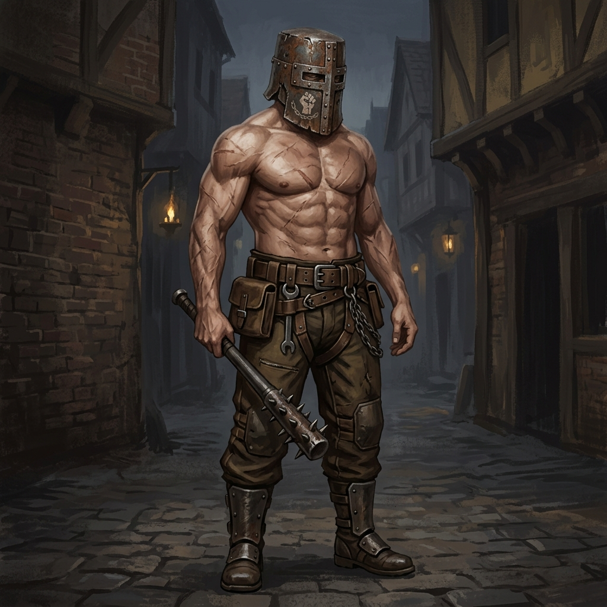
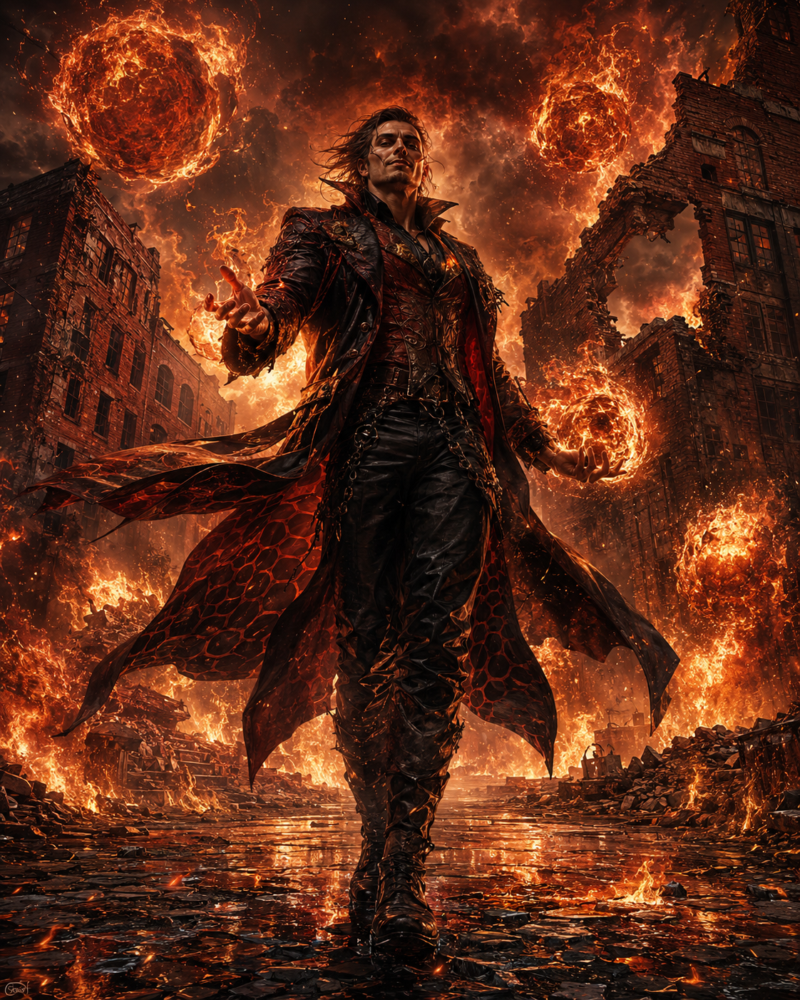
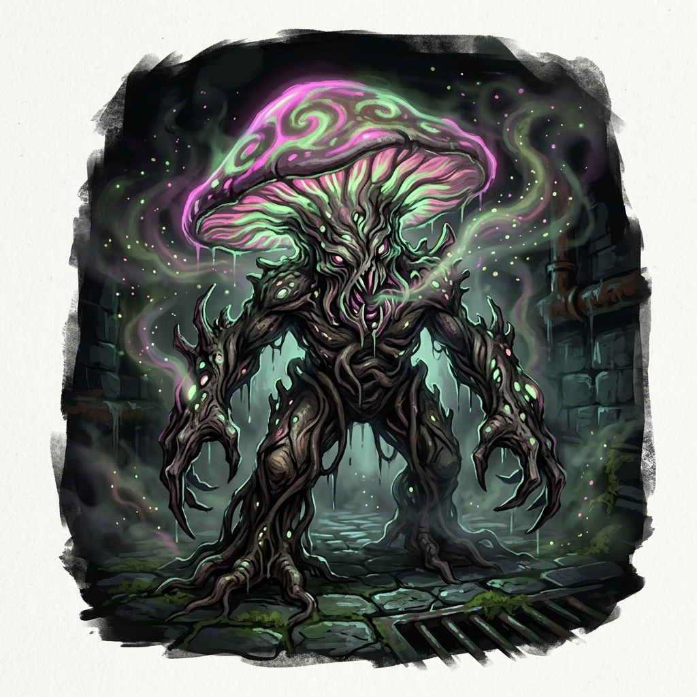
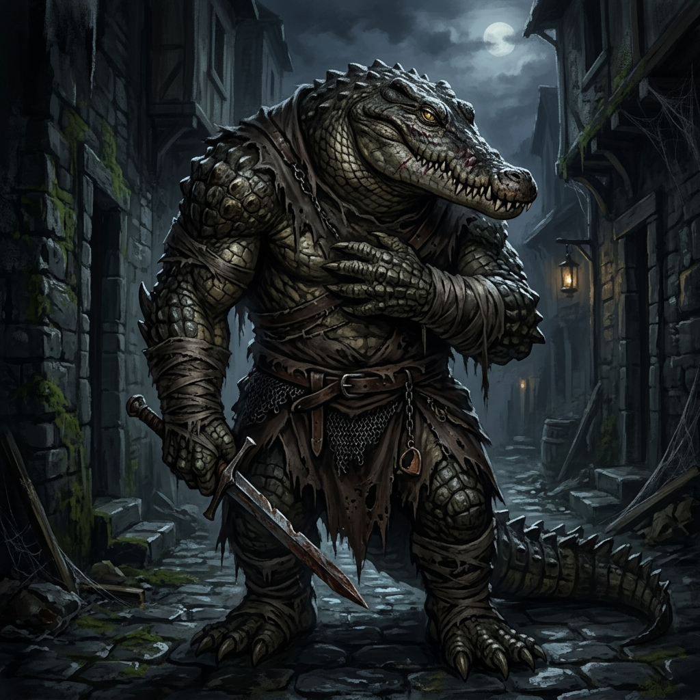
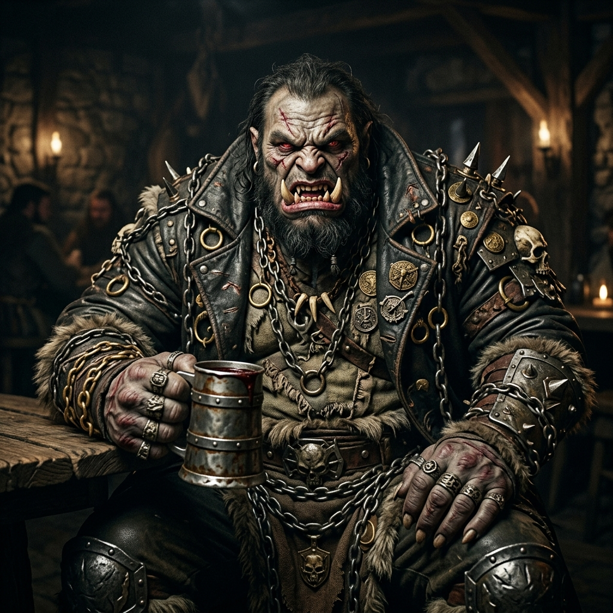
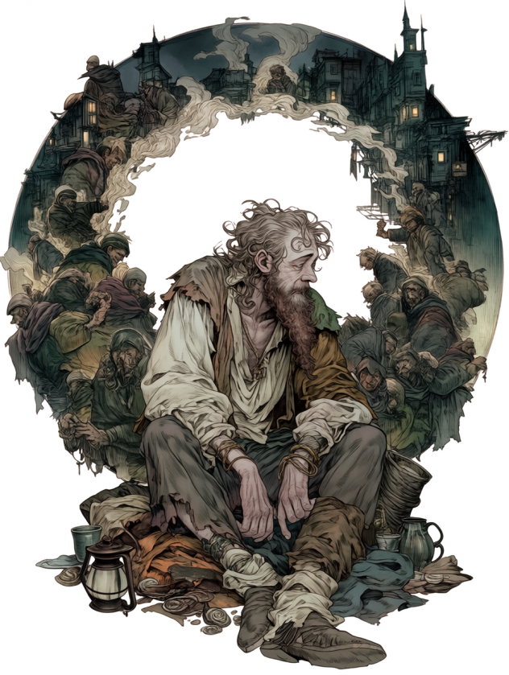
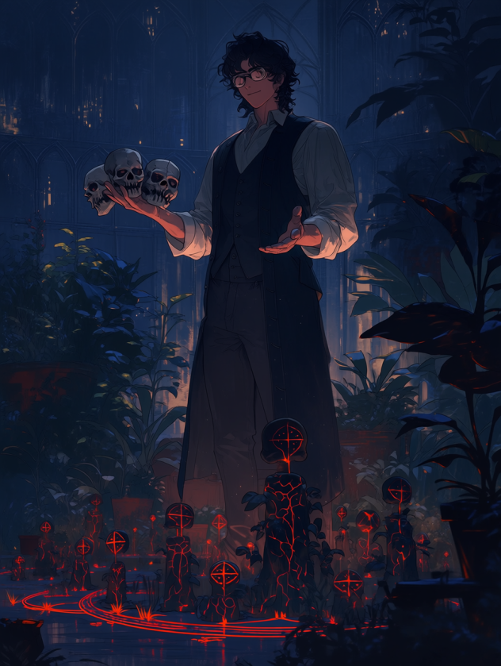
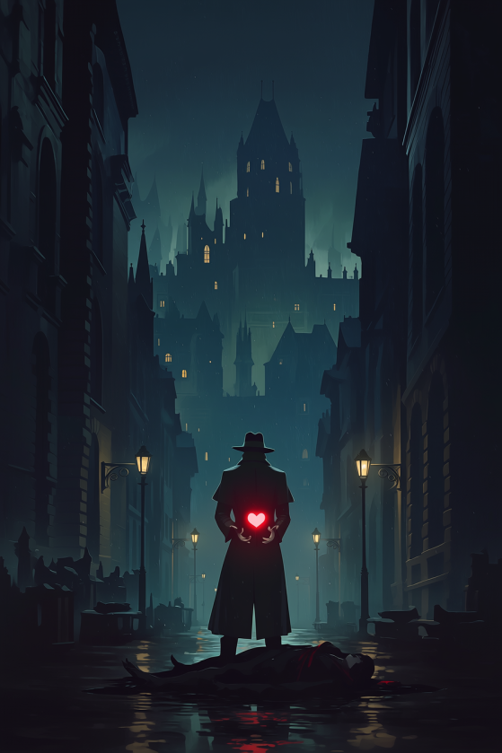
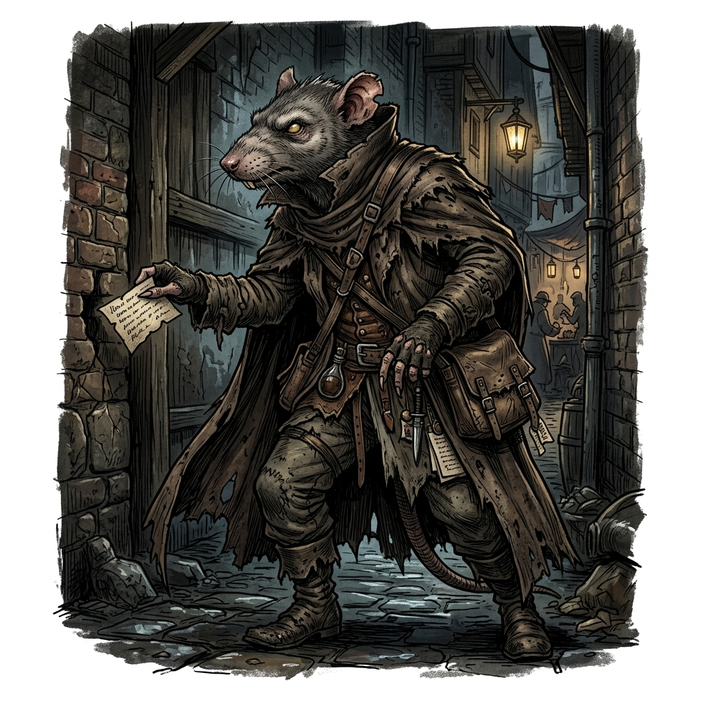

# 【閲覧注意】王都の夜を歩くなら命を捨てろ！ 最新版「鉄人会・抗争マップ」＆危険地帯ガイド

**「知らずに入った路地裏で、一般市民が抗争の巻き添えに…」**
**そんな悲劇を避けるため（という名目で）、本誌は裏社会の勢力図を独自に入手。今、絶対に近づいてはいけない「死のエリア」を完全公開する。**

---

## 終わらない血みどろの抗争劇！ 最大手『鉄人会』vs 古参『黒蛇』

現在、王都の裏社会は二つの巨大な勢力によって二分されている。
一つは、伝統的な暗殺と密輸で裏社会を牛耳ってきた古参の闇組織『黒蛇』。
もう一つが、ダンジョン利権を基盤に裏社会の最大手へと上り詰めた完全な反社ギルド『鉄人会』である。

*(鉄人会構成員。上半身裸に鉄兜という無骨な出立ちだが、冷徹に「業務」として暴力を遂行する実働部隊)*

彼らは「違法薬物（レッド・ダスト）」の利権や、闇魔法具の保管庫を巡って日夜激しいシマ争いを繰り広げている。
一般人が巻き込まれるケースも後を絶たず、「夜な夜なトロールのうめき声が聞こえる」「倉庫から腕のない死体が運ばれていた」といった凄惨な噂が絶えない。

### 【コラム】歪みゆく鉄人会の「鉄人思想」
初代の頃の鉄人会は、魔力を持たない人々や無力な人々の「反骨精神」が根っこにあるギルドであった。しかし最近は「筋肉の力のみでダンジョンを攻略する」という筋肉至上主義のような異様な方向へ進んでおり、これを**「鉄人思想」**と呼ぶ。これは、組織を巨大化させた二代目時代の武闘派筆頭幹部、**『鋼拳』のバルガス**の思想が色濃く影響しているとされている。

### 【コラム】素人向け：鉄人会と黒蛇の「見分け方」
鉄人会の構成員は見た目が異様（上半身裸に鉄兜など）で一目でそれと分かる。また組織的な教育が行き届いているため、こちらが縄張りを荒らすなどの粗相をしなければ一般市民に危害を加えることは少ない。
一方、黒蛇の構成員は**一般市民の姿で街に紛れ込んでいることが多く、魔術主体であるため見た目で戦闘能力が全く類推できない**。すれ違っただけの温和な商人が、裏社会の凄腕エージェントかもしれないのが黒蛇の本当の恐ろしさだ。

---

## 【危険度MAX】下町「赤レンガ倉庫街」：抗争の最前線

現在、最も血なまぐさいのがこのエリアだ。
表向きは輸入商の倉庫が並ぶエリアだが、夜になれば両ギルドの構成員が刃物と火球を飛び交わせる戦場へと変貌する。

*   **主な危険：** 流れ弾（魔法）、拉致、誤認による襲撃、**魔力による壁への生き埋め**
*   **異常事態：** 抗争の犠牲者か、黒蛇の闇魔法によって**「生きたまま赤レンガの壁に塗り込められている人々」**の姿が複数確認されている。
*   **目撃情報（近隣住民・ドワーフ）：** 「火球の暴発で夜中でも昼みたいに明るい日があった。翌朝見に行ったら、地面がガラス化してたぜ。あと、倉庫の壁に鉄人会のチンピラが塗り込められて呻いてるのを見た……。あそこには絶対近づかねえ方がいい」

*   **要注意人物（黒蛇）：”火蜥蜴（サラマンダー）”**
    *   **特徴：** 黒蛇の「武力」の象徴とも言える強力な火の魔法使い。暗殺や隠密が主体の黒蛇において、彼だけは派手な広範囲殲滅魔法を好んで使用する。
    *   **被害：** 彼が交戦した跡地は地面がガラス化するほどの超高温に晒される。赤レンガ倉庫街における「火球の暴発」の正体は間違いなく彼である。

*   **地下下水道の脅威①：逃亡した麻薬キノコ**
    *   元々は違法薬物用に培養されていたキノコだが、自ら走って逃亡し、赤レンガ地下の下水で独自に繁殖している。人間に寄生する性質があり、頭を「ぱやぱや（多幸感で空っぽ）」にした人間を下水の奥深くで繁殖用に飼育しているという恐ろしい噂がある。

*   **地下下水道の脅威②：ワニ男（魔物化病）**
    *   元は下水で暮らしていた亜人だが、亜人が完全に人間性を失って魔物化する奇病にかかった成れの果て。普段は理性を失った凶暴な怪物だが、満月の夜だけわずかに人間性を取り戻し、地上（赤レンガの路地）に出てくると言われている。

## 【危険度高】貧民街「西地区水路沿い」：鉄人会の実効支配地域

かつてはホームレスや売春婦のたまり場だったが、現在は完全に『鉄人会』の実効支配下にある。
ここでは「ショバ代」を払わない露天商や住人が、見せしめに暴行される事件が多発中だ。

*   **要注意人物：** ”粉砕者”ガルド（鉄人会幹部・オーガ種）
    *   **特徴：** 酒癖が悪く、目が合っただけで撲殺される恐れあり。全長2.5メートルの巨躯で、重さ数百キロの鉄塊を軽々と振り回す。**鉄のコップで相手の頭をかち割り、酒に血を足して飲む**という異常な嗜好を持つ。
    *   **最近の被害：** 酔っ払ったガルドが「俺の酒がまずい」という理由で、居酒屋を建物ごと粉砕した事件が発生。衛兵隊すら見て見ぬふりをしているという。

*   **特異点（不可侵領域）：”魔力喰い”のホームレス** （本名不明）
    *   **特徴：** 周囲の魔力を無意識に吸収してしまう特異体質を持つ男。わずかでも魔力を有する者は、彼に近づかれただけで強烈な嫌悪感や吐き気を催すため、幼い頃から激しい迫害を受けてきた。現在は人との関わりを絶ち、水路沿いの片隅でひっそりと暮らしている。
    *   **裏社会での扱い：** 過去に「両組織を震撼させる何か」を起こしたとされており、狂暴な鉄人会も、魔術を操る黒蛇も、彼にだけは決して手を出さない。抗争の最前線にあって、彼の周囲だけは誰も寄り付かない完全な「不可侵領域」となっている。

## 【危険度中】歓楽街「裏カジノ通り」：一触即発の無法地帯

表向きは華やかなカジノ街だが、一歩裏路地に入れば借金取りと用心棒が闊歩する無法地帯。
最近、鉄人会が強引な取り立てを行い、黒蛇の系列カジノと小競り合いを起こしている。
「酔っ払って路地裏で寝る」のは、自ら身ぐるみ剥いでくれと言っているようなものだ。

*   **要注意人物（黒蛇）：** ”庭師（ガーデナー）” （本名不明の黒蛇のエージェント）
    *   **特徴：** 見た目は完全に一般市民の魔術者。人間を「植物の種」に変えてしまうという極めて特異な魔術を操る。
    *   **能力と手口：** 敵を種に変えて捕縛・無力化するほか、魔法陣から兵隊や魔物を召喚して戦わせる。彼が生成した「種」は、彼の血液をかけることで元の生物（人間）に戻るという。抗争で行方不明になった鉄人会の構成員たちは、彼の庭に種として「植えられている」という都市伝説が囁かれている。

*   **要注意人物（黒蛇）：”心臓狂い（ハートブレイク）”**
    *   **特徴：** 黒蛇に雇われている異常な「盗賊」。金品ではなく、すれ違いざまにターゲットの体内から生きたまま「心臓」をすり取って（盗み出して）持ち去るという、極めて恐ろしい魔法技術を持つ。
    *   **被害：** 路地裏で、外傷がないのに胸の中にポッカリと空間が空いた（心臓だけが盗み出された）鉄人会構成員の死体が発見されれば、それは間違いなく「心臓狂い」の仕業である。

---

## 【唯一の希望】独立勢力『灰色の猟犬』の護衛エリア

絶望的な王都の裏社会において、唯一の希望とも言えるのが独立勢力の用心棒組織**『灰色の猟犬（アッシュ・ハウンド）』**だ。
彼らはおびただしい数の反社勢力に理不尽に虐げられる人々を守り、反抗するために生まれた組織であり、鉄人会や黒蛇を明確に「敵」として排除する。
元傭兵や退役騎士からなる実力派集団であり、彼らが雇われている店舗や、護衛として巡回しているエリア（主に東地区の職人街や一部の商業区）では、反社勢力もうかつに手を出せない。
どうしても夜に危険地帯を歩かなければならない場合は、彼らを護衛に雇うのが最も生存率の高い選択肢である。

---

## 編集部からの警告

*(本誌に極秘情報を提供した情報屋ラット。「これ以上嗅ぎ回ると俺の命が危ない」と言い残し、現在行方不明)*

このマップの「空白地帯」は安全という意味ではない。
そこは、**「どの組織も手出しできないほどヤバい奴（個人）」**や**「異界化したダンジョンへの入り口」**がある場所かもしれないのだから……。

王都の夜は、文字通り「魔物が潜む」。
読者の皆様は、夜の外出を控え、自宅の戸締まりと防御結界の更新を忘れないようにしていただきたい。

（文・王都裏事情通　情報屋ラット）
