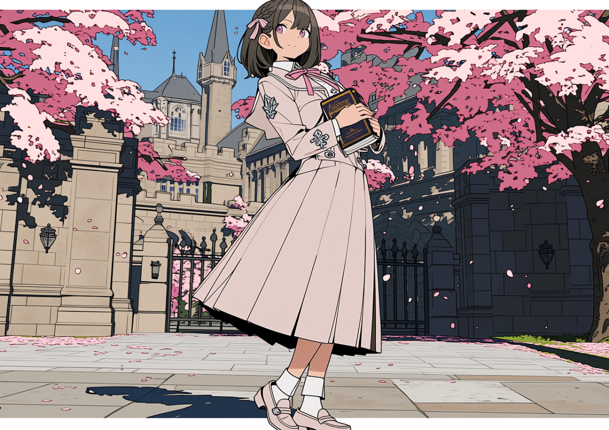
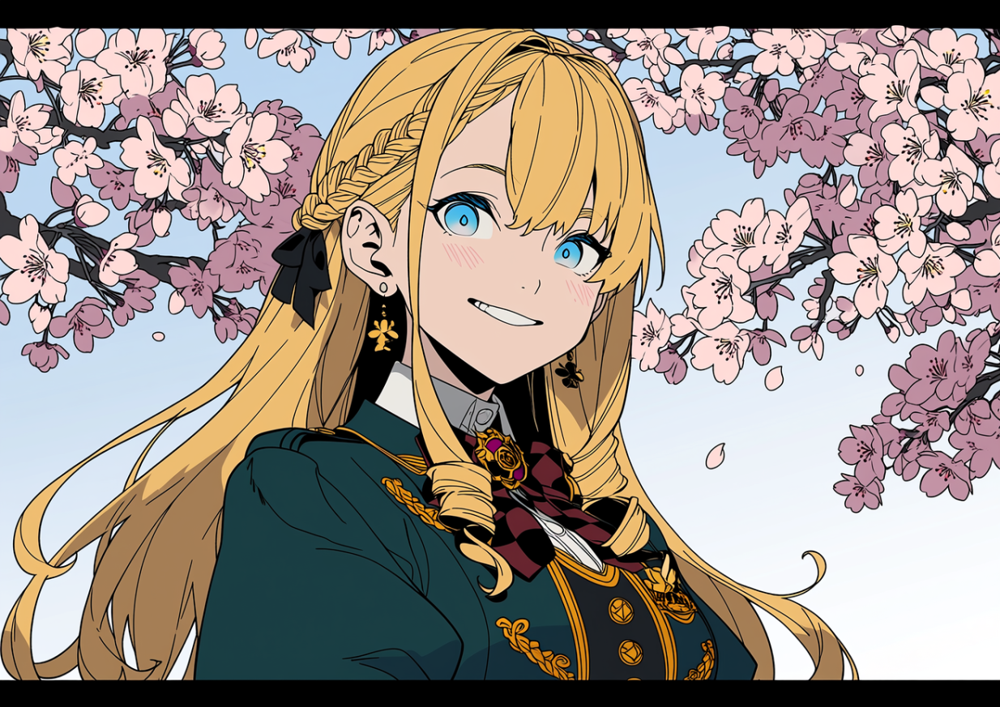
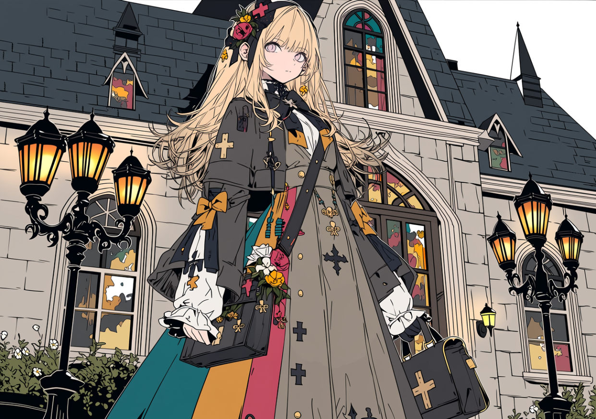

# 王都女学院春の制服名鑑・軽量版
## 桜花・金獅子・薔薇十字――制服を見れば、その子の未来までだいたいわかる？

王都に春が来た。

桜が咲き、新入生の馬車が行き交い、仕立屋街が一年でいちばん忙しくなる季節である。そしてこの時期、王都の人々がつい目で追ってしまうものがある。

女学院の新しい制服だ。

王都の三大女学院といえば、王都桜花学園、金獅子女学院、薔薇十字女学院。どれも名門だが、校風はかなり違う。制服を見れば、家柄だけでなく、信仰、財力、得意な魔術、卒業後の進路までなんとなく見えてくる。

今回は、春の王都を歩く三校の制服を、気軽に見比べてみよう。

## 王都桜花学園――上品、清楚、でも意外と現場向き

<figure class="uniform-figure uniform-figure-ouka">
  
  <figcaption>桜花：淡い桜色と白。礼法、回復、浄化をそつなくこなす王道のお嬢様制服。</figcaption>
</figure>

桜花の制服は、三校の中でいちばん「王都のお嬢様」らしい。

淡い桜色と白、整った襟、控えめなリボン、長めのスカート。派手さはないが、歩いても座ってもきれいに見える。茶会にも教会行事にも、そのまま出られそうな安心感がある。

桜花学園は、聖教会とのつながりが深い学校だ。礼法、家政、宮廷作法のほか、回復魔法、浄化、保護、慈善事業の運営などを学ぶ。王族や貴族の娘だけでなく、上級官僚、富裕商家、民間名士の子女も多い。

見た目は優雅だが、制服は案外実用的である。袖は祈りや回復術の動きを邪魔しない。胸元には聖印や護符を収められる。スカートは舞踏会向きに見えて、施療院の手伝いや慈善訪問でも乱れにくい。

つまり桜花生は、微笑みながらお茶を出し、そのまま負傷者の手当てもできる。

上品で、清潔で、気配りができて、いざというときに頼れる。桜花の制服は、そんな理想をそのまま形にした服である。

## 金獅子女学院――隠す気のない財力と後援力

<figure class="uniform-figure uniform-figure-golden-lion">
  
  <figcaption>金獅子：紺、白、金。家の財力、商会の人脈、軍閥の後援を堂々と見せる制服。</figcaption>
</figure>

金獅子の制服は、遠くからでもすぐにわかる。

布がいい。仕立てがいい。金の刺繍が光る。鞄も靴も手袋も、よく見ると全部いいものだ。

金獅子女学院は、軍人家系、大商会、金融家、鉱山主、海運業者、魔道具産業などと深く結びついている。学校そのものが、資金、物流、補給、人脈の巨大な社交場といっていい。

制服の基本形は決まっているが、細部にはかなり自由がある。襟飾り、ブローチ、リボン留め、外套の裏地。どれも規定内だが、見る人が見れば、どの商会の品か、どの工房が作ったか、誰が後援しているかまでわかる。

金獅子では、財力を見せること自体が悪いとはされない。大切なのは、下品にならず、相手にきちんと伝えることだ。

授業でも、商取引、契約、資産管理、補給、寄付、財団運営、社交戦略などを学ぶ。卒業後は、実家の帳簿や倉庫や人脈を本当に動かす立場になる生徒も多い。

金獅子生が強いのは、攻撃魔法が得意だからではない。

家が強い。財布が強い。倉庫が強い。紹介状が強い。

制服一着が、ほとんど名刺であり、広告であり、契約前の挨拶なのである。

## 薔薇十字女学院――静かな制服ほど魔術的には物騒

<figure class="uniform-figure uniform-figure-rose-cross">
  
  <figcaption>薔薇十字：白、深紅、黒。清楚な見た目の中に、術式制御と高等魔術を詰め込んだ制服。</figcaption>
</figure>

薔薇十字の制服は、三校の中でいちばん静かだ。

白、深紅、黒を基調に、装飾は少なめ。金獅子ほど輝かず、桜花ほど柔らかくもない。姿勢のよさと規律がよく目立つ。

ただし、見た目だけで判断してはいけない。

薔薇十字女学院は、魔術師協会が主導する学校である。魔術理論、術式解析、結界術、攻撃魔法、魔道具制御、魔術倫理などを学び、将来は魔術師協会、研究機関、魔道具工房、術式研究会へ進む生徒が多い。

制服も、飾るためというより、魔力を安定させるために作られている。高い襟は姿勢と呼吸を整える。袖は杖や触媒を扱いやすい形になっている。深紅のリボンやサッシュは魔力制御具を兼ね、胸元の薔薇十字紋は所属や術式系統を示す。

一見すると清楚な優等生。しかし鞄の中には、術式集、予備の触媒、魔力測定器、場合によっては訓練用の攻撃杖まで入っている。

薔薇十字の制服が静かで整っているのは、おとなしいからではない。危険な力を、きちんと制御しているからだ。

## 三校をざっくり比べると

| 学院 | 主な色 | 背後にある組織 | 得意分野 | 制服が伝えること |
|---|---|---|---|---|
| 王都桜花学園 | 桜色・白 | 聖教会、王族、貴族、民間上層 | 礼法、回復、浄化、慈善実務 | 清潔、信頼、品位、奉仕 |
| 金獅子女学院 | 紺・白・金 | 軍閥、商会、金融、鉱山、海運 | 契約、資産、物流、社交戦略 | 財力、家格、人脈、後援力 |
| 薔薇十字女学院 | 白・深紅・黒 | 魔術師協会、研究会、魔道具工房 | 魔術理論、術式、結界、攻撃魔法 | 規律、知性、魔力制御、専門性 |

三校とも名門だが、目指している人物像はまったく違う。

桜花は、人と家と教会を支える者。

金獅子は、金と物と人脈を動かす者。

薔薇十字は、魔術を理解し、制御し、発展させる者。

春の王都で制服姿の新入生を見かけたら、色やリボンだけでなく、袖口、ブローチ、外套、胸元の紋章にも注目してみてほしい。

その一着には、本人がまだ知らない未来まで縫い込まれているかもしれない。