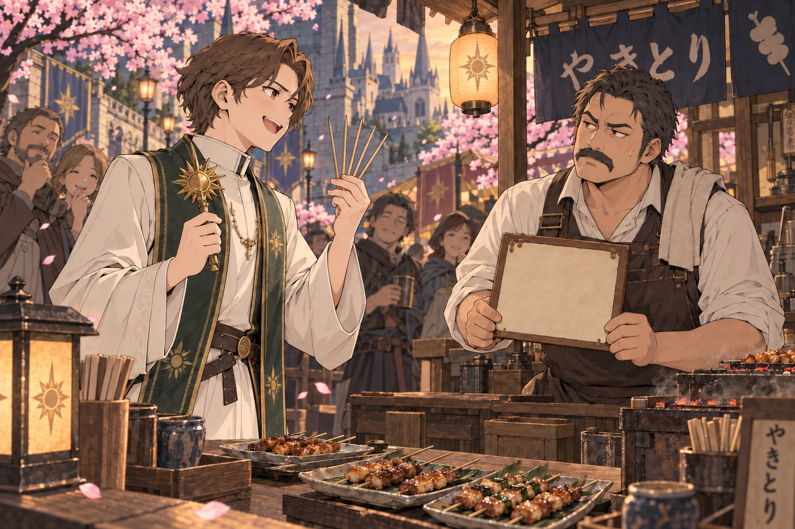
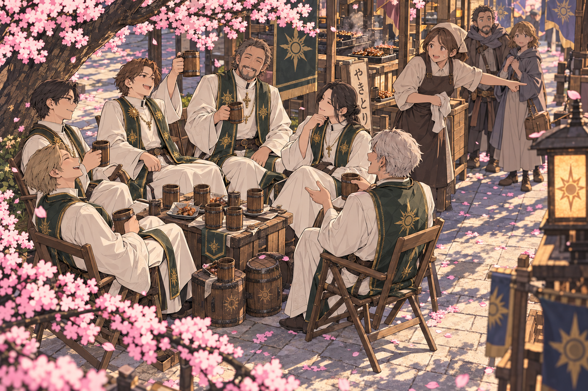
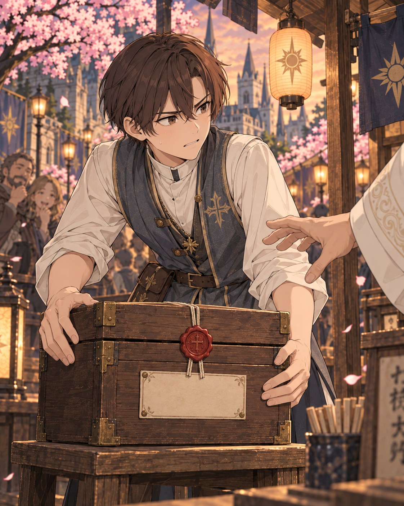
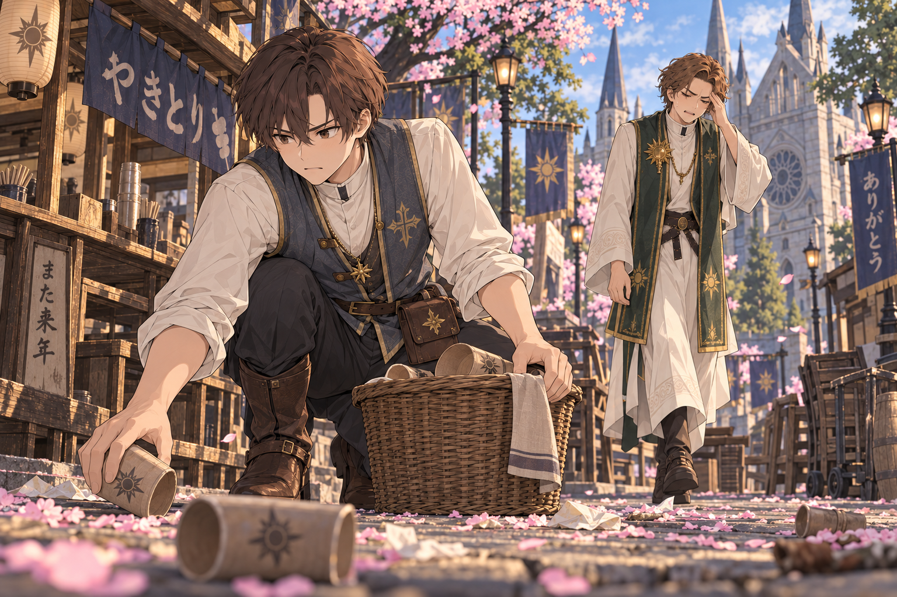

# 聖職者花見乱痴気騒ぎ
## 銅貨九十六枚、祈祷で払うつもりか――串焼き屋で始まった酔いどれ説法

「その肉は、私が清めました」

「焼いたのは私です」

王都西公園、春祭り初日の屋台通り。串焼き屋「三本角」の主人ガンゾと、聖教会の助祭ベルノが向かい合っていた。ベルノの右手には祈祷具、左手には食べ終えた串が五本。ガンゾは銅貨九十六枚と書いた勘定板を両手で持っていた。

後ろの花見客は、笑うべきか拝むべきか決めかねていた。

<figure>
  
  <figcaption>▲ 祈祷具と食べ終えた串五本を手に、祝福料を持ち出すベルノ。ガンゾは勘定板を掲げて応じる。</figcaption>
</figure>

## 昼の祝福式は、ちゃんと終わっていた

その日のベルノたち六人は、西公園の仮祭壇で旅人と出店者の無事を祈っていた。式の開始は正午、終了は十二時四十分。少なくともこの時点では、誰も屋台の勘定について神学的な見解を求めていない。

式後に振る舞った清めの酒は一人一杯。そこへ差し入れの小樽が二つ来た。助祭たちは折り畳み椅子を桜の下へ移し、見物客にも席を勧めた。

寄付箱の管理を任されていた書記見習いのニノは、何度か帰り支度を促したという。

「箱を戻しましょうと言ったんです。そしたら『まだ人々の善意が集まる』と」

午後四時には、善意より空杯の方がよく集まっていた。

同じ祝祷が三度繰り返され、そのたびにベルノは出店者の繁栄を願った。三度目には近くの揚げ芋屋が「繁栄させるなら客をこっちへ通してくれ」と言いに来た。椅子の輪が通路まではみ出していたのだ。

<figure>
  
  <figcaption>▲ 桜の下に広がった六人の椅子の輪。差し入れの小樽二つを足元に、屋台へ続く通路までふさいでしまった。</figcaption>
</figure>

## 八本の串に、何回祈ったか

一団が三本角へ来たのは午後六時過ぎ。注文したのは猪串十本、山鳥串八本、香草酒六杯、平パン三枚だった。

焼き台に祈祷具をかざしたベルノが、肉の傷みを遅らせる祝福を施した。ガンゾは止めなかった。生肉を入れた冷箱にはありがたい術だ。ただし、ベルノが清めていたのは、まもなく客が食べる焼き上がりの串だった。

会計でベルノは言った。

「通常なら祝福料をいただくところです」

「頼んでません」

「祭りですから、半額で結構」

「どっちが払う話ですか」

傍らの若い聖職者まで、串一本ごとの祝福を数え始めた。ガンゾによれば、山鳥串は八本なのに祈った回数は九回だった。途中で同じ皿を清め直したらしい。

### 三本角の勘定板

<figure>
  
  <figcaption>▲ 三本角の猪串と山鳥串、平パン、香草酒。六人分の注文と勘定は下表のとおり。</figcaption>
</figure>

| 注文 | 数量と単価 | 小計 |
|---|---|---:|
| 猪串 | 十本 × 銅貨三枚 | 銅貨三十枚 |
| 山鳥串 | 八本 × 銅貨三枚 | 銅貨二十四枚 |
| 香草酒 | 六杯 × 銅貨六枚 | 銅貨三十六枚 |
| 平パン | 三枚 × 銅貨二枚 | 銅貨六枚 |
| 飲食計 | 六人分 | 銅貨九十六枚 |
| ベルノが主張した祝福分 | 店側の注文なし | 相殺を拒否 |

「九十六枚を払ってから、祝福の仕事を取りに来てくれ」。ガンゾがそう言うと、客列の後ろから拍手が起きた。ベルノは説法への賛同と受け取ったらしく、さらに声を張った。

## 寄付箱を開けようとしたのは誰だ

勘定が止まったまま、隣の団子屋「花輪」の女将サヨが口を挟んだ。

「その箱は何のお金？」

祭壇から持ってきた寄付箱が、ニノの椅子の下にあった。箱には公園脇の小礼拝堂の屋根修繕と書いてある。会計の話をしていた聖職者の一人が箱へ手を伸ばし、ニノが蓋を両腕で押さえた。

「屋根のお金です。胃のお金ではありません」

<figure>
  
  <figcaption>▲ 寄付箱を押さえるニノ。蓋は閉じたままで、封印にも破れは見られない。</figcaption>
</figure>

箱が実際に開いたという証言はない。ニノが保管した封印にも、その場で破れは見つからなかった。飲食代への流用があったとまでは言えない。それでも箱を守る見習いと、勘定を値切る助祭の取り合わせは、十分に人を集めた。

別の客は、寄付をすれば屋台で割引になるのだと思っていたという。サヨは首を振った。

「だったら団子屋の箱に入れてください。うちにも修繕したい所はあります」

## 教会の説明と、店の返答

午後七時前、連絡を受けた教区の会計係が到着し、飲食代を立て替えた。一団はようやく席を立ったが、ベルノは帰り際、三本角の繁盛をもう一度祈った。ガンゾは代金を数え終えてから頭を下げた。

翌日、教会は「若手聖職者数名に節度を欠く振る舞いがあった」と説明。立替分は当人たちへ請求し、修繕寄付とは別に処理すると回答した。寄付箱の集計額は公表していない。

| 教会側の回答 | 屋台側の受け止め |
|---|---|
| 祝福は好意によるものだった | 「好意は勘定板から引けません」――ガンゾ |
| 飲食代は支払い済み | 「止まった客列までは戻りません」――サヨ |
| 翌朝の清掃に関係者を派遣した | 「最初に来たのは箱を守った子でした」――公園掃除人 |

朝八時、ニノは桜の根元で酒杯を拾っていた。ベルノが現れたのはその二十分後。頭を押さえていたが、二日酔いを清める祈祷はできないのかという問いには答えなかった。

<figure>
  
  <figcaption>▲ 翌朝の片付けに先に来たのはニノ。二十分遅れのベルノは、頭を押さえて現れた。</figcaption>
</figure>

三本角の値札には、新しい一行が加わっていた。

> お会計は銅貨で。祝福は営業時間外にお願いします。
