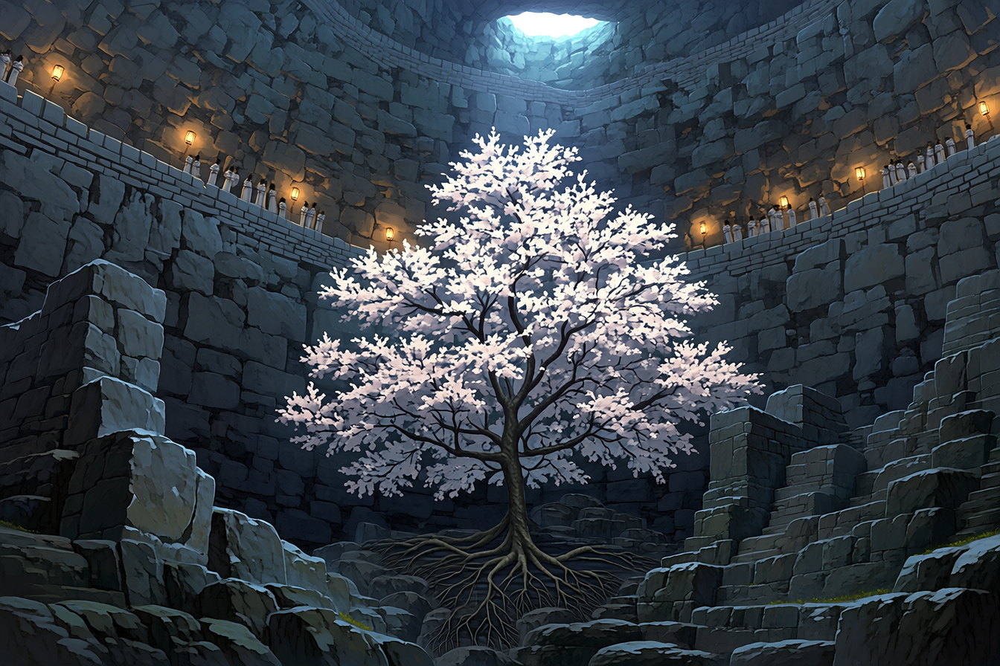

# 花見ダンジョン危険案内
## 頭上は満開、足元は四十二段。地下桜を一周七十分で見る。

王都北東、旧石切り場の口をくぐると、桜が上からではなく横から迫ってくる。吹き抜けの底に根を張った一本が、地下の回廊まで枝を持ち上げているのだ。花を見下ろし、横から眺め、最後には枝の下を歩く。同じ木で三度花見ができる。

今春の公開順路を、入口の案内人オルネと歩いた。掲載の時刻と料金は春季公開初週の掲示。増水や落石で閉じる日は入口で引き返す。迷宮の全域開放ではなく、旧採掘路の一部を見物用に区切った催しだ。

<figure>
  
  <figcaption>▲ 下の庭園から仰ぐ地下桜の情景。枝の高さまで回廊が回る。道順・段数は本文の案内を参照。</figcaption>
</figure>

### 入口で切り取って持ちたい案内札

| 項目 | 今春の公開初週の案内 |
|---|---|
| 王都から | 北東門から徒歩約四十分。石切り場行きの道標を追う |
| 受付 | 09:00〜15:00入場、16:30閉場 |
| 見物路 | 一周約六百メートル。見物込み約七十分、石段四十二段を下り、別の四十二段で戻る |
| 入場料 | 一人銅貨12。入口広場の屋台だけなら入場券不要 |
| 案内同行 | 一人銅貨8追加。最大六人、入口へ戻るまでの一周分 |
| 灯り | 掲示された順路に固定灯あり。灯火の故障時は係員が通路を閉鎖 |
| 帰りの目印 | 青い矢印と「三番上り口」。入口へ逆走しない |

段差のない別経路はない。階段を使えない人には、入口の幻影記録屋が地下桜の記録を一回銅貨2で映している。実物より風が少なく、花粉も飛んでこない。

## 0m　入口広場｜食べるのは、降りる前か帰ってから

**所要十分／ここだけで引き返す花見も可。**

屋台「石粉亭」の迷宮まんじゅうは二個銅貨5。石のような灰色の皮を割ると、芋餡が出る。店主は「石粉は入れていない」と毎回説明する。隣の桜色魔石飴は一袋銅貨3。名に魔石とあるが菓子で、入口札にも「魔力補充には使えません」とある。

地下へ酒は持ち込めない。オルネは、団子の串も食べ終えてから捨てるよう声をかけていた。以前、壁穴へ串を差し入れ、巣の主に引き抜かれた客がいたためだ。

## 80m　四十二段の石段｜花はまだ見えない

**下り五分／手すり側を一列に。**

三十段目で冷たい空気に変わる。ここで帽子を押さえようと振り向くと、後ろの客の足がすぐ近くにある。花見の荷物は背中から大きく張り出さないものにしたい。

壁の苔が途切れる箇所は、係員が削って足掛かりを補修した跡。「苔がないから乾いている」とは限らない。踏み板が濡れる日は受付で通行を止めるので、閉鎖札を係員より先に読むつもりで。

## 160m　上の桜回廊｜最初の一枚は、ここで

**見物十五分／記録台は二か所、各組二分交替。**

吹き抜けの向こう側から、枝が回廊の高さまでせり出す。壁の固定灯に照らされた花弁の裏へ、地上の昼光が薄く透ける。下の庭園を歩く人は、花の隙間に小さく見える。

幻影記録を残すなら、壁側の窪んだ記録台へ。通路の中央から後ずさりして構図を広げない。柵の外へ身を乗り出せば、足場は回廊より先に終わっている。

案内人のおすすめは十時前。正午近くになると、花よりも向こうの回廊の客がよく写る。

## 310m　地下庭園｜桜を見上げられる休憩所

**休憩十五分／座れる石台は六人分。**

幹の根元には採石の切り口が残っている。切り出しかけの石を包むように根が伸び、花びらは石の溝へ溜まる。庭園の中央へ踏み込む道はなく、見物は外縁の敷石から。足元の細い根もまたがず、敷石の上を進む。

ここで聞こえる笛のような声は、係員の合図ではない。岩笛コウモリが壁穴から鳴いている。オルネが「口笛を返さないで」と言い終わる前に、ひとりの客が返した。壁の三か所から返事が来た。

「返ってくるまでは、皆さん喜ぶんです」

### 花の隣に住んでいるもの

| 魔物 | どこを見ると気づくか | 見物路で困ること |
|---|---|---|
| 岩笛コウモリ | 庭園北壁の横長の穴。耳より先に鳴き声 | 口笛や強い光で群れが動く。照明を向けない |
| 花殻ヤモリ | 灯りの届かない石縁。薄桃色の尾 | 花びらに紛れている。拾おうと指を出さない |
| 苔甲虫 | 手すり外側の丸い苔玉 | 団子の匂いへ寄る。餌付けすると帰り道までついてくる |

姿が見えなければ探しに行く必要はない。この三種を見るための脇道も設けられていない。

## 420m　水路の柵前｜音を聞いたら折り返し標へ

**通過五分／ここから奥は非公開。**

水音が大きくなったら、右壁の青い矢印へ。正面の柵の先が地下水路、左の縄の先が旧坑道だ。どちらも出口への近道ではない。古い採掘道の地図を持参した客が「ここで合流するはず」と言ったが、その合流点は現在水没しているという。

係員は管理側の案内・警戒担当。王都市内の巡回衛兵が迷宮内まで常駐しているわけではない。異常を見つけたら、入口か順路上の係員へ場所を伝える。

## 600m　三番上り口から、もう一度屋台へ

**上りと帰路二十分。休まず歩く客も、階段上でいったん息を整える。**

上り口には桜ではなく、三本の青線が描かれている。同行者と別れた時はここを待合場所にせず、係員へ伝えて入口広場へ。段差の途中で待つと、後ろの人まで待つことになる。

入場12、案内8、まんじゅう5、飴3、果実水4で、今回の一人予算は**銅貨32**。入場料と案内料以外は買わなくても歩ける。厄除け札は観光の入場条件ではない。

外へ出ると、石粉亭の店主が「上と下、どっちの桜がよかった」と聞いてきた。オルネは靴底を払ってから答えた。

「今日は、全員が自分の足で戻ったところ」

客のひとりが、灰色のまんじゅうをもう一包み買った。今度は石に見えなかったらしい。
