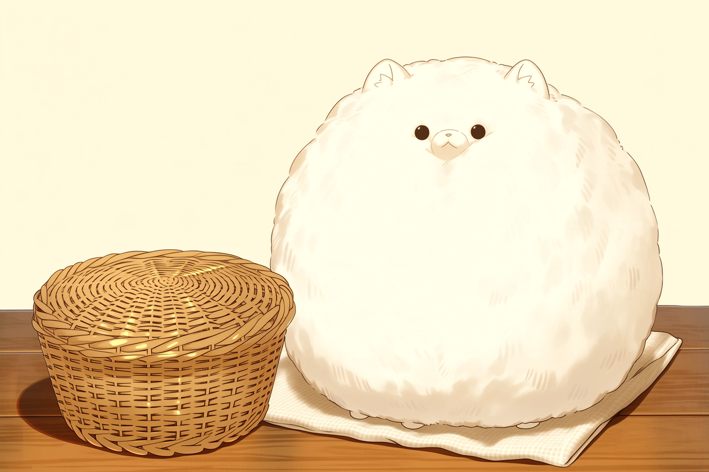

# 魔物の育て方 新入生編
## 手のひらで買って、洗面器サイズに。モコ一匹の三週間。

王都へ来た学院生サナは、白い綿玉モコを「ポポ」と名づけた。買った日は、掌に二つ載りそうな大きさだった。三週間後、同じ掌を並べてみると、毛の外縁が指先を越えた。

露店の札には「小型」とあった。嘘とまでは言えない。隣にいた石かじり仔竜よりは、ずっと小さい。ただし、サナの買った籠に収まるという意味でもなかった。

飼育相談所「芽床」の飼育係イラと、ポポの記録を開く。寸法や費用はこの個体の飼育記録と相談所の目安。どの個体も同じ日に同じ大きさになるわけではない。

## ポポの飼育帳｜膨らんだのは毛か、体か

綿玉モコは、短い四本脚と小さな丸耳を毛の内側へ隠す魔物だ。空気を含んだ毛が丸く立つため、見た目の直径と体の大きさは同じではない。驚くとさらに毛を膨らませる。

| 日 | 毛の外側までの直径 | 一日の穀物粉 | サナの記録 |
|---|---:|---:|---|
| 迎えた日 | 約8cm | 6g | 掌に載せて寝顔を見た。餌皿を寝床と間違える |
| 七日目 | 約12cm | 9g | 毛が籠の留め金へ絡む。床へ落ちた毛を同居人が埃と思って拾う |
| 十四日目 | 約17cm | 12g | 巾着へ入らなくなる。元の籠は移動用にも狭い |
| 二十一日目 | 約22cm | 15g | 幅五十センチの飼育箱へ移す。驚くとさらに大きく見える |

イラはポポを無理に押さえず、自然に足を出した時の体つきと動きを見た。毛を押し潰して「まだ八センチ」と測り直すのは違うという。生活する箱には、毛を含めて向きを変えられる余地がいる。

「小さい箱なら大きくならないって、同じ寮の子が」

「箱が先に壊れない種でも、体調は悪くなります」

サナは小籠を洗い、餌袋の保管籠へ使い直した。

<figure>
  
  <figcaption>▲ ポポと、役目を変えた小籠。毛に隠れた足まで押し込んで使い続けるわけにはいかない。寸法は飼育帳を参照。</figcaption>
</figure>

## 餌を足す前に、皿を見る

モコの餌は穀物粉。ポポは器に頭を突っ込むので、毎食後に鼻先の毛が白くなる。サナは皿からなくなった分を全部食べたと思い、追加していた。

イラが敷紙を持ち上げると、こぼした粉が折り目から出た。以後、サナは量った分を朝夕に分け、残りとこぼれを確認する。表の餌量はポポの体調を見ながら調整した量で、別種や全個体への一律の処方ではない。

水は餌とは別の浅い器。濡れた敷材をそのままにすると、毛の内側に湿りが残る。毛が静かだから機嫌がいいとも限らず、動き、食べ残し、呼吸の様子を毎日同じ時間に記す。

## 「小型」の札を、物差しで読み直す

| 種 | 成体の大きさの目安 | 一日の餌の目安 | 住まいで響くこと |
|---|---|---|---|
| 綿玉モコ | 毛を含む直径20〜25cm | 穀物粉12〜18g | 毛が舞う。通気と敷材の乾燥が必要 |
| 光卵トカゲ | 尾を含み全長35〜45cm | 小虫8〜12匹 | 夜間の発光と爪音。遮光しても通気は塞がない |
| 瓶水クラゲ | 傘の幅8〜12cm | 専用水草粉を個体に合わせて計量 | 販売瓶は輸送用。育成は水槽、急な水質変化が苦手 |
| 跳ね角ウサギ | 胴長30〜40cm | 干し草主体、根菜は補助 | 跳躍音が下階へ響く。高さにも余裕が要る |
| 眠り羽虫 | 翼を広げて4〜6cm | 専用の希釈花蜜 | 静かだが隙間から逃げる。網目と扉を確認 |
| 石かじり仔竜 | 成体は全長2〜3m | 成長後は鉱石片数kg単位 | 幼体でも石材をかじる。寮の部屋を育成場所にしない |

「瓶水クラゲ」という名を、瓶で一生飼える意味に取らない。「仔竜」という札も、成体の種別と飼育設備を説明する札の代わりにはならない。表は比較用で、実際の給餌と容器は入手先・飼育係に個体ごとに確認する。

### 卵売場へ持っていく質問は、三つ

**何の種か。成体はどこまで大きいか。孵化後に相談できる人は誰か。**

光る卵二つを並べた露店で、片方は光卵トカゲと種名が書かれ、もう片方には「お楽しみ」としかなかった。前者の店員は親個体の記録を見せた。後者は「なつけば平気」と答えた。

サナは卵の値段より、育った後の行き先を聞いた。後者の店に引取先はなかった。卵を買わずに帰ると、ポポが空の包み袋へ頭を入れた。新しい同居人より、袋のほうが気になるらしい。

## ポポに払った分、これから払う分

| 初めに必要だったもの | 金額 |
|---|---:|
| ポポ本体 | 銀貨2 |
| 成長後も使う通気付き飼育箱 | 銀貨3 |
| 餌皿・水皿・掃除用の小刷毛 | 銅貨8 |
| 最初の籠（現在は餌袋入れ） | 銅貨5 |

寮の許可は購入前に取った。追加飼育料はないが、共用部へ毛を持ち出さない条件だった。上の表に保証金や追加家賃は含まれていない。

| 一か月の見込み | 数量・条件 | 費用 |
|---|---|---:|
| 穀物粉 | ポポが一日15gなら三十日で450g。500g袋を購入 | 銅貨6 |
| 敷材 | 二包 | 銅貨4 |
| 清掃用の布・消耗品 | 一組 | 銅貨2 |
| 合計 | 飼育箱の買替え・診療を除く | **銅貨12** |

「本体は銀貨二枚」と聞いた時、サナは箱の銀貨三枚を数えていなかった。今は餌代とは別に、診療や買替えのための小袋も作っている。診療費を定額で保証する話ではなく、急な出費の時に食費と混ぜないためだ。

## 留守の日の、ポポの担当

授業の長い日は同居人に一回の水確認を頼み、頼んだ日を飼育帳へ書く。「誰かが見たはず」を作らないためだ。夏の帰省は寮に残る友人へ押しつけず、芽床の預かり枠を相談中。枠は限られ、当日持ち込めば必ず預かれるわけではない。

飼えなくなった場合も、店と相談所に先に連絡する。野外へ放すと、穀物粉の皿も、乾いた箱も、そこにはない。

取材の終わり、サナが古い写真代わりの幻影記録を映した。掌の小さなポポ。その横で、本物のポポが飼育帳の角に頬をこすりつけている。

「もう小さく戻ってほしくはないです。箱は、最初から大きいのを買いたかったけど」

イラは帳面の次の欄に「二十八日目」と書いた。まだ白いその一行にも、毛が一本ついていた。
