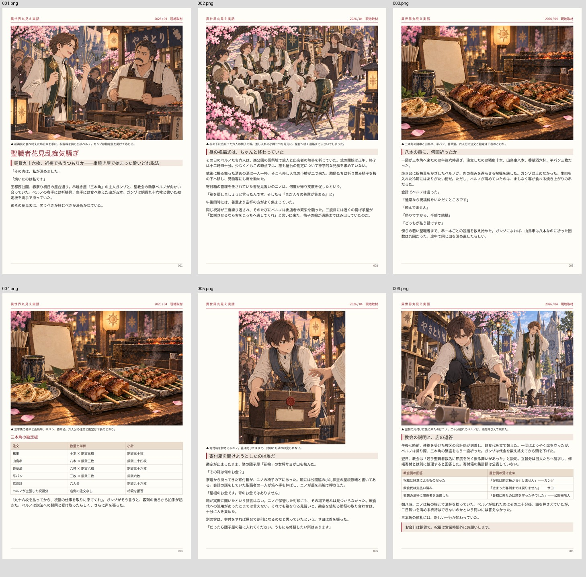

# Markdown組版の検証記録

実施日：2026-10-04。開始時master：`85897e947f2decc421e140e3266a3853a31c9a26`。

新規10件、既存56件、計66件が成功しました。[結果JSON](results.json) に詳細を記録しています。

新規試験は、実記事の同期と読取専用検査、候補生成の無書込、長段落と表の分割、巨大見出しの停止、未対応記法と画像対応の拒否、画像・フォント欠落、原稿・画像・HTML更新後の出力停止、PNG寸法とハッシュ、描画後の欠落・重なり検出、プレビュー一致と古い原稿の検出を含みます。長段落と45行の表は7ページへ分割し、文字列・セル・順序の一致を確認しました。失敗系は独立fixtureで行い、実記事の原稿と画像を破損させて試験しません。

実記事は45ブロック、採用画像5点、6ページです。全ページの画像枠面積が文字ブロック面積を上回り、共通紙面検査のerror・warningは0件でした。直下HTTPプレビューとPNG6枚は同一環境で画素差0です。別環境での一致を主張しません。

```bash
PREVIEW_CHROMIUM=/path/to/chromium npm run test:article-source
PREVIEW_CHROMIUM=/path/to/chromium npm run test:layout-safety
PREVIEW_CHROMIUM=/path/to/chromium npm run test:preview
PREVIEW_CHROMIUM=/path/to/chromium npm run test:article-output
```

`PREVIEW_CHROMIUM` を省略するとPlaywright既定のChromiumを使用します。実記事比較の前に、対象記事を同期・PNG生成してください。出力は `exports/article-source-tests/` です。

環境はLinux、Node v24.19.0、Playwright 1.60.0、Chromium 133.0.6943.0、DPR 1。記事に埋め込んだNoto由来WOFFのハッシュと文字集合は記事の `fonts/font.json` にあります。



この一覧はレビュー用の縮小画像です。最終PNGは記事の `pages/001.png`〜`006.png`、紙面とソースの版・PNGハッシュは `intermediate/article_manifest.json` です。PNGは本文原稿のユーザー承認や校了を意味しません。利用者のdev実機・Pages公開・全号・EPUBは今回の検証範囲外です。
