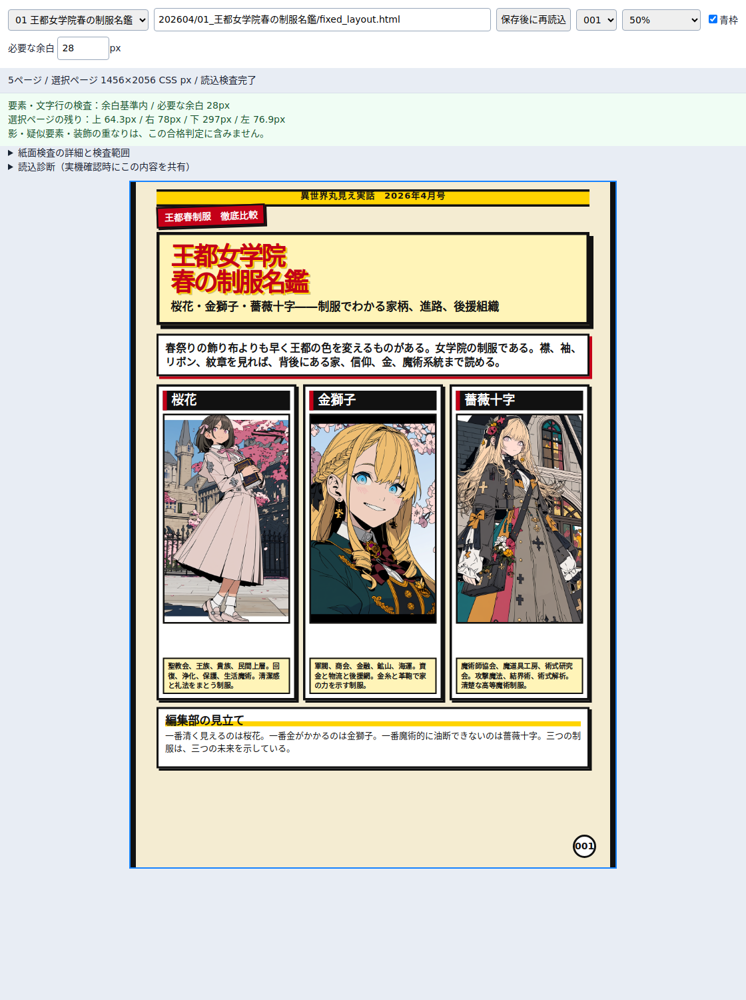

# 紙面の安全余裕：実装と検証記録

実施日：2026-10-04。開始時masterは `817ee167c908a3422ff6225d085146d6b62c5454` です。

## 結果

共通検査24件、プレビュー16件、記事出力16件の計56件が成功し、失敗は0件でした。ソースファイルのSHA-256、使用フォントのSHA-256、保護したツリーは [evidence.json](evidence.json) に記録しています。

1. [共通検査24件](geometry-results.json)：紙面外20px、28pxと27.6pxの境界、内側と外側のoverflowクリップ、折返しなし文字列、スクロール内の切れ、visibilityの上書き、回転した祖先、読込中画像、失敗したフォント、fallback、アニメーション、疑似要素等の警告、ブラウザとNodeのAPI一致を含みます。実行コードは [run.mjs](run.mjs) です。

2. [プレビュー16件](preview-results.json)：従来の12件を保持し、資産成功と紙面失敗の分離、必要余白の変更、倍率とページ切替による計測値の不変、遅延追加・全ページ削除後の旧合格撤回を確認しました。実行コードは [../preview/run.mjs](../preview/run.mjs) です。

3. [記事出力16件](export-results.json)：検査だけの実行で記事へ書き込まないこと、レポート保存先、正常PNGの実寸、検査や読込失敗時の旧出力保持、候補画像の切替、タイムアウト、2つ目の出力フォルダ置換失敗時の復元を確認しました。実行コードは [export.mjs](export.mjs) です。

PNG比較は、表紙1ページと制服名鑑5ページの全6ページで成功しました。同じ環境で、元HTMLを直接撮影したPNGと、プレビュー内に表示した同じ記事を比較しています。実寸は1456×2056、全要素と文字行の相対座標は0.001 CSS pxに丸めた比較で一致しました。既存の画素差閾値は緩めていません。画像全体の画素完全一致や、ユーザーのWindowsとの一致は意味しません。

新しい診断表示によってプレビュー上部の高さが増えたため、比較撮影時の外側viewportを2800pxへ広げました。紙面全体が画面内にあり、上の操作欄に隠れていないことを撮影前に検査します。内部viewportは1456×2056のままです。

## 実記事の実測

既存HTMLに対しては `--check-only` で検査し、記事のPNGや中間出力を作り直していません。[表紙の結果](cover-report.json) と [制服名鑑の結果](uniforms-report.json) が詳細です。

計測対象の最小余白は、表紙が約60.2px、制服名鑑全体が約64.3pxでした。制服名鑑の本文要素側の下端残りは、ページ順に約297.0px、571.0px、571.0px、571.0px、1159.0pxです。

これは実要素箱・文字行箱の余白です。制服名鑑の上部帯は疑似要素のtop:22px、ページ番号も疑似要素でbottom:28pxにあり、上の数値には含めていません。影・疑似要素等の未計測描画は、表紙11件、制服名鑑全体24件のwarningとして残っています。完成紙面のすべてのインクに64px以上の余裕がある、という主張ではありません。

通常HTTPでの新しい表示例です。元の紙面内容を変更せず、計測表示を外側へ追加しています。



## 再実行

NodeとPlaywright Chromiumが動く環境で実行します。

```bash
npm ci
npx playwright install chromium
npm run test:layout-safety
npm run test:preview
npm run test:article-output
```

既存のChromiumを使う場合は `PREVIEW_CHROMIUM` にその実行パスを指定します。

```bash
PREVIEW_CHROMIUM=/absolute/path/to/chromium npm run test:layout-safety
PREVIEW_CHROMIUM=/absolute/path/to/chromium npm run test:preview
PREVIEW_CHROMIUM=/absolute/path/to/chromium npm run test:article-output
```

試験結果は `exports/layout-safety-tests/`、`exports/preview-tests/`、`exports/layout-safety-export/` へ出ます。プレビューは `PREVIEW_TEST_OUTPUT` で出力先を変えられます。ここに保存した結果JSONは検証記録であり、通常の試験実行だけでは書き換わりません。

共通検査とUIのfixtureはメモリ上で配信します。記事出力のfixtureは独立した一時フォルダへ作り、終了時に片付けます。HTTPサーバーはloopback限定です。

## 実行環境と確認できていないこと

Node v24.19.0、Playwright 1.60.0、Chromium 133.0.6943.0、Linux、DPR 1、screen mediaで実行しました。通常のPlaywrightブラウザ配布からの取得は不完全なZIPで失敗したため、検査環境にはnpmの `@sparticuz/chromium` 133.0.0に含まれるブラウザを用意しました。プロジェクトの依存関係やlockfileは変更していません。

日本語フォントは、[Noto CJKの公式リポジトリ](https://github.com/notofonts/noto-cjk/blob/main/Sans/OTF/Japanese/NotoSansCJKjp-Regular.otf) のNoto Sans CJK JP Regularを検査環境のfontconfigへ追加しました。フォント本体はリポジトリへ保存していません。旧9月23日のNoto Sans JPの記録とは別の実環境です。WindowsのHiragino/Yu Gothic等の指定と同じ描画になることは検証していません。

利用者のvscode.dev / github.dev、CodeSwingの実機保存・再読込は未確認です。模擬中継・通常HTTPの成功と、実機のCSP、service worker、仮想ワークスペースの成功を同一視しません。

疑似要素・影・mask・paint containment等の描画、要素同士の重なり、原稿の欠落、Markdown同期、任意の将来の動的変更は、この幾何検査の合格範囲外です。従来の24px許容に隠れていた20pxのはみ出しを検出できたことを、すべてのCSSと紙面への万能保証へ拡張しません。正式な範囲は [安全余裕の仕様](../../docs/15_layout_safety_contract.md) を参照してください。

## 原稿と出力の保護

202603と202604のツリーSHAは開始時から不変です。今回の実記事に対する作業は読取・検査だけで、原稿・固定HTML・画像・既存のpreview PNGを変更していません。実際のPNG生成と失敗時復元の試験は独立fixtureに対して行いました。強制killや電源断の途中からの自動復旧は今回の試験・保証範囲に含めていません。
